# 计算机基础-1

### 一、计算机系统

计算机系统由硬件（Hardware）和软件（software）系统两个部分组成。

 

### 二．计算机硬件

计算机（Computer):俗称电脑，是一种能**接收和存储**信息，并按照存储在其内部的程序对海量数据进行自动、高速地处理，然后把处理结果输出的现代化智能电子设备发展历史：

第一代计算机（1946-1957)

第二代计算机（1958-1964)

第三代计算机（1965-1970)

第四代计算机（1971以后）

1946年，世界上第一台计算机 ENIAC(electronic numerical integrator andcalculator)在美国宾州大学诞生，是美国奥伯丁武器试验场为了满足计算弹道需要而研制成的。使用了17468只电子管，占地170平方米，重达30吨，耗电174千瓦，耗资40多万美元。每秒可进行5000次加法或减法运算电子管时代晶体管时代集成电路时代大规模集成电路时代。

计算机硬件组成

冯诺依曼体系结构：1946年数学家冯·诺依曼于提出，计算机硬件由运算器、控制器、存储器、输入设备和输出设备五大部分组成

摩尔定律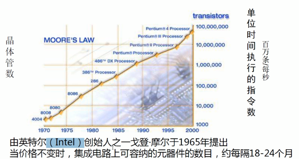

按规模分类

巨型计算机：应用于国防尖端技术和现代科学计算中。巨型机的运算速度可达每秒百万亿次以上，1“天河一号”为我国首台千万亿次超级计算机大型计算机：具有较高的运算速度，每秒可以执行几千万条指令，而且有较大的存储空间。往往用于科学计算、数据处理或作为网络服务器使用，如：IBMz13 mainframe小型计算机：规模较小、结构简单、运行环境要求较低，一般应用于工业自动控制、测量仪器、医疗设备中的数据采集等方面微型计算机：中央处理器（CPU)采用微处理器芯片，体积小巧轻便，广泛用于商业、服务业、工厂的自动控制、办公自动化以及大众化的信息处理

服务器

服务器 Server 是计算机的一种，是网络中为客户端计算机提供各种服务的高性能的计算机，服务器在网络操作系统的控制下，将与其相连的硬盘、磁带、打印机及昂贵的专用通讯设备提供给网络上的客户站点共享，也能为网络用户提供集中计算、信息发布及数据管理等服务服务器按应用功能可分为：Web 服务器、数据库服务器、文件服务器、中间件应用服务器、日志服务器、监控服务器，程序版本控制服务器、虚拟机服务器、邮件服务器、打印服务器、域控制服务器、多媒体服务器、通讯服务器、ERP 服务器等服务器按外形分类：塔式服务器、刀片式服务器、机架式服务器

塔式 Tower 服务器

早期的服务器形式外形以及结构和平时使用的立式 PC 差不多机箱空间大，主板扩展性较强，插槽较多预留了足够的内部空间，以便日后进行硬盘和电源的冗余扩展，设计一般都考虑降噪目前较少使用

 

### 三、服务器组成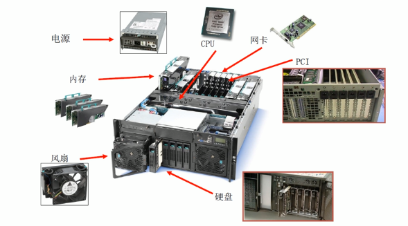

服务器配置示例

#### 服务器硬件—CPU

CPU 是 Central Processing Unit 的缩写，即中央处理器。由控制器和运算器构成，是整个计算机系统中最重要的部分服务器 CPU 公司

主频：

主频是 CPU 的时钟频率（CPU Clock Speed),是 CPU 运算时的工作的频率（1秒内发生的同步脉冲数）的简称。单位是 Hz.一般说来，主频越高，CPU 的速度越快，由于内部结构不同，并非所有的时钟频率相同的CPU的性能都一样外频：系统总线的工作频率，CPU 与外部（主板芯片组）交换数据、指令的工作时钟频率倍频：

倍频则是指 CPU 外频与主频相差的倍数三者关系是：

主频＝外频x倍频高速缓存（cache):高速交换的存储器。CPU 缓存分为一级，二级，三级缓存，即L1,L2,L3内存总线速度（Memory-Bus Speed):一般等同于CPU的外频，指 CPU 与二级（L2)高速缓存和内存之间的通信速度地址总线宽度：

决定了 CPU 可以访问的物理地址空间

服务器分类

按照 CPU 体系架构来区分，服务器主要分为两类：非 x86服务器：使用 RISC (精简指令集）或 EPIC (并行指令代码）处理器，并且主要采用 UNIX 和其它专用操作系统的服务器，指令系统相对简单，它只要求硬件执行很有限且最常用的那部分执令，CPU 主要有 Compaq 的 Alpha、HP 的 PA-RISC、IBM 的 Power PC、MIPS的 MIPS 和 SUN 的 Sparc、Intel 研发的 EPIC 安腾处理器等。这种服务器价格昂贵，体系封闭，但是稳定性好，性能强，主要用在金融、电信等大型企业的核心系统 x86 服务器：又称 CISC(复杂指令集）架构服务器，即通常所讲的 PC 服务器，它是基于 PC 机体系结构，使用 Intel 或其它兼容 x86 指令集的处理器芯片的服务器。目前主要为 intel 的 Xeon E3,E5,E7 系列，价格相对便宜、兼容性好、稳定性较差、安全性不算太高。

#### 服务器硬件—主板

主板 mainboard、系统板 systemboard 或母板 motherboard,安装在机箱内，是计算机最基本的也是最重要的部件之一主板一般为矩形电路板，上面安装了组成计算机的主要电路系统，一般有 BIO S 芯片、I/O 控制芯片、键盘和面板控制开关接口、指示插接件、扩充插槽、主板及插卡的直流电源供电接插件等元件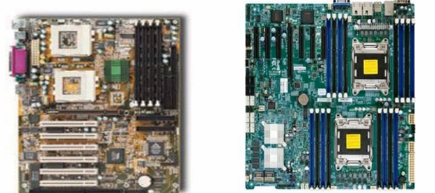

#### 服务器硬件—内存

容量：即该内存的存储容量，单位一般为“MB”或“GB”内存带宽：

内存带宽是指内存与北桥芯片之间的数据传输率单通道内存节制器一般都是64-bit的，8个二进制位相当于1个字节，换算成字节是64/8=8,再乘以内存的运行频率，如果是 DDR 内存就要再乘以2计算公式：内存带宽＝内存总线频率x数据总线位数／8示例：DDR 内存带宽计算

DDR2 667,运行频率为333MHz,带宽为333x2x64/8=5400MB/s=5. 4GB/sDDR2 800,运行频率为400MHz,带宽为400x2x64/8=6400MB/s=6. 4GB/s

#### 服务器硬件—硬盘

机械硬盘结构：存储介质（Media)-盘片盘片的基板是金属或玻璃材质制成，为达到高密度高稳定的质量，基板要求表面光滑平整，不可有任何暇疵

读写头（Read Write Head)-磁头磁头是硬盘读取数据的关键部件，它的主要作用就是将存储在硬盘盘片上的磁信息转化为电信号向外传输马达（Spindle Motor &Voice Coil Motor)马达上装有一至多片盘片，以7200, 10000, 15000 RPM等定速旋转，为保持其平衡不可抖动，所以其质量要求严谨，不产生高温躁音

硬盘基本参数

硬盘基本参数：容量容量是硬盘最主要的参数。单位有 MB、GB、TB 转速转速是指硬盘盘片每分钟转动的圈数，单位为 rpm.现在硬盘的转速已经达到10000rpm,15000rpm

传输速率

传输速率（Data Transfer Rate).硬盘的数据传输率是指硬盘读写数据的速度，单位为兆字节每秒（MB/s)

缓存硬盘缓存的目的是为了解决系统前后级读写速度不匹配的问题，以提高硬盘的读写速度

#### 服务器硬件—阵列卡

Raid 卡：用来实现 RAID 的建立和重建，检测和修复多位错误，错误磁盘自动检测等功能。RAID 芯片使 CPU 的资源得以释放阵列卡（RAID卡）的作用阵列卡把若干硬盘驱动器按照一定要求组成一个整体、由阵列控制器管理的系统。

阵列卡用来提高磁盘子系统的性能及可靠性阵列卡参数＞支持的 RAID 级别阵列卡缓存电池保护

#### 服务器硬件—电源

电源和风扇

·支持服务器的电力负载·支持冗余，防止电源故障

－故障预警和防止

－故障之前的预防性维护－保证服务器持续运行

电源子系统包括

－智能电源和风扇

－冗余电源和风扇

#### 服务器硬件—显卡GPU

服务器都在主板上集成了显卡，但是显存容量不高，一般为16M 或32MGPU:Graphic Processing Unit,即“图形处理器”

#### **服务器硬件—网卡**

服务器都在主板上集成了网卡，传输速率为1Gbps,即干兆网卡特殊应用需要高端网卡，如光纤网卡，Infiniband 网卡等，传输速率能达到 10Gbps、20Gbps,即万兆网卡

#### 服务器硬件—热插拔技术

热插拔技术

称为热交换技术（Hot Swap),允许在不关机的状态下更换故障热插拔设备常见的热插拔设备：硬盘，电源，PCI 设备，风扇等热插拔硬盘技术与 RAID 技术配合起来，可以使服务器在不关机的状态下恢复故障硬盘上的数据，同时并不影响网络用户对数据的使用

#### 服务器硬件—机柜

机架式服务器－服务器放置在机柜中通常使用的机柜是 42U (约2米高）机柜（1U=44. 45mm)外观尺寸一般为：宽600*深1000*高2000(mm)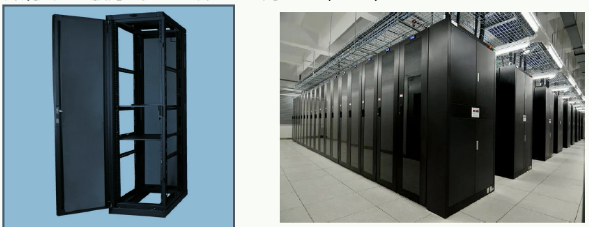

#### **存储基础知识－－－存储网络**

网络连接存储（Network Attached Storage):通过局域网在多个文件服务器之间实现了互联，基于文件的协议（NFS、NFS、SMB/CIFS等），实现文件共享

管理配贸客户司以由任何一台客产端经

服务客可队实现证联

·集中管理数据，从而释放带宽、提高性能·可提供跨平台文件共享功能·可靠性较差，适用于局域网或较小的网络

存储区域网络（Storage Area Networks,SAN)·利用高速的光纤网络链接服务器与存储设备，基于 SCSI,IP,ATM 等多种高级协议，实现存储共享

服务器跟储存装置两者各司其职利用光纤信道来传输数据，以达到一个服务器与储存装置之间多对多的高效能、高稳定度的存储环境实施复杂，管理成本高

 

### 四、操作系统

#### 一、分类

OS:Operating System,通用目的的软件程序户硬件驱动进程管理内存管理网络管理安全管理文件管理 OS 分类：

##### 应用软件操作系统

服务器 OS:RHEL,CentOS,Windows Server,AIX桌面

OS:Windows 10,Windows 7,Mac OS,Fedora移动设备

OS:Andriod,IOS,YunOS

##### 开发接口标准

ABI: Application Binary InterfaceABI 描述了应用程序与 OS 之间的底层接口，允许编译好的目标代码在使用兼容 ABI 的系统中无需改动就能运行

API: Application Programming Inte rfaceAPI 定义了源代码和库之间的接口，因此同样的源代码可以在支持这个 API 的任何系统中编译

POSIX: Portable Operating System InterfaceIEEE 在操作系统上定义的一系列API标准 POSIX 兼容的程序可在其它 POSIX 操作系统编译执行运行程序格式：

Windows: EXE,.dll(dynamic link library)

libLinux: ELF. so(shared obiect), ,a

**Linux 就是 Unix 一种变动，就是他的一种分支**

#### 二、Linux哲学思想

准确的说这是 Unix 哲学

##### 一切皆文件

一切皆文件包括硬件在内，例如你在 Linux 里配置硬盘，它表现为一个文件，你配置光驱，再拿一个文件，他都表现一个文件一点。

##### 小型，单一用途的程序

Linux 很多情况下是在字符界面工作的，所以看到的都是一个文件一个文件，在另一个里面有好多好多小工具，功能很单一，只做一件事

##### 链接程序，共同完成复杂的任务

但是要想做好了，需要把它们连接起来完成复杂任务才行，而这个连接实际上就是所谓的编脚本，编程序。

##### 避免令人困惑的用户界面

图形界面看到的现象有可能是不真实的，这个简单例子，在很多年前有一次配IP地址，当时还是在NT系统里面，现在也一样，大家都知道IP地址就是在网卡属性里面配，结果配完了以后点完确定了，结果发现网络始终是不通的，这个地址配的明明没有问题，老是有问题，在 Windows 里有个命令行， IP config，一看地址才发现网关没出来，就网关是空的，不如 Linux 的命令行界面可靠。

##### 配置数据存储在文本中

注册表是一个文本文件，它是二进制的文件，如果注册表出了故障，机器都起不来了，起不来大不了拿光盘启动， Windows 就比较麻烦，所以相对来讲 Windows 的可控制性还是差，Windows 源代码不公开。而 Linux 可以从头构建一个，出了问题也容易解决，所以另外相对来讲更加稳定更加可靠。所以相对来讲 Linux 更容易深入学习。

# 计算机基础-2

## 数据表示

- 定点表示法

  - 定点表示法表示的数(称为定点数)常分为定点整数和定点小数两种

  - 小数点不需要占用一个存储位

  - 定点整数的最大值为：2（n-1）-1，定点小数的最大值为：1-2-(n-1)

- 浮点表示法

  - 用阶码和尾数来表示数，称为浮点数

  - 在总位数相同的情况下，浮点表示法可以表示更大的数

- 原码、反码、补码、移码（正数的原码、反码、补码都一样）

  - 原码：正数0，负数1

  - 原码和反码表示范围：-127~+127 补码和移码表示范围：-128~+127

## 计算机测试

- 黑盒测试注重于测试软件的功能性需求
  - 黑盒测试试图发现以下类型的错误：功能错误或遗漏、界面错误数据结构或外部数据库访问错误、性能错误、初始化和终止错误

- 白盒测试中，白盒可以发现：代码路径中的错误、死循环、逻辑错误
  - 白盒测试方法，应根据程序的内部逻辑和指定的覆盖标准确定测试数据

## 计算机系统的组成

### 中央处理器CPU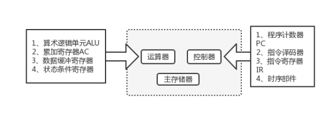

- ALU运算器、通用寄存器、状态寄存器、程序技术器、累加器等部件都是属于CPU中的部件

- CPU产生每条指令的操作信号并将操作信号送往相应的部件进行控制

- 程序计数器PC除了存放指令地址，不可以临时存储算术/逻辑运算结果

- CPU中的控制器决定计算机运行过程的自动化

- 指令译码器是CPU控制器中的部件

- 在CPU中用于跟踪指令地址的寄存器是==(程序计数器（PC）(属于CUP的控制器组成部件)==

- 通用寄存器常用于暂存运算器需要的数据或运算结果

- 地址寄存器(MAR)和数据寄存器(MDR)用于访问内存时的地址和数据暂存

- ==指令寄存器（IR）==用于暂存正在执行的指令

- 在CPU中，常用来为ALU执行算术逻辑运算提供数据并暂存运算结果的寄存器是(累加寄存器)中

- 计算机CPU对其访问速度最快的是（通用寄存器）

- 加法器是算术逻辑运算单元的部件

- 指令系统采用不同的寻址方式的目的是（扩大寻址控件并提高编程灵活性）

- 为便于实现多级中断嵌套，使用（堆栈）来保护断点和现场最有效

- CPU的中断响应时间指的是（从发出中断请求到开始进入中断处理程序）

- 最大吞吐率取决于流水线中最慢一段所需的时间

- 如果流水线出现断流，加速比会明显下降

- 要使加速比和效率最大化应该对流水线各级采用相同的运行时间

- 流水线采用异步控制并不会给流水线性能带来改善，反而会增加控制电路的复杂性

- I/O接口编制分为：统一编制，单独编制。统一编制通过访问内存单元的指令访问I/O接口。单独编制需要设置专门的I/O指令访问I/O接口

- 在计算机系统中采用总线结构，便于实现系统的积木化构造，同时可以（减少信息传输的数量）

- 流水线方式不可以提高指令的执行速度

- 总线宽度是指总线的线数，即数据信号的并行传输能力，也体现总线占用的物理空间和成本；总线的带宽是指总线的最大数据传输率，即每秒传输的数据总量。总线宽度与时钟频率共同决定了总线的带宽

- 带宽(MB/S）=时钟频率(MHz)/时钟周期×总线宽度(bit)/8

- 并行总线适合近距离高速数据传输

- 串行总线适合长距离数据传输

- 单总线结构在一个总线上适应不同种类的设备，但无法达到高的性能要求

- 专用总线在设计上可以与连接设备实现最佳匹配

- 中间代码可以用树和图表示

### 基础硬件

- SSD实质上是（Flash）

- 固态硬盘常见的的接口有：SATA、PCle、M.2

- (相联存储器)是指按内容访问的存储器

- 闪存掉电后信息不会丢失、属于非易失性存储器；以块为单位进行删除操作；在嵌入式系统中用来代替ROM存储器

### 计算机系统体系

- 计算机指令一般包括操作码和地址码两部分，为分析执行的一条指令，其中操作码和地址码都应存入指令寄存器（IR）中

- 指令寄存器的位数取决于( 指令字长 )

- 指令周期：取出并执行一条指令所需时间

- 总线周期：CPU从存储器或者I/O接口存取一个字节所需时间

- 时钟周期：CPU处理动作的最小单位

- 相互关系：一个指令周期可以划分一个或多个总线周期；一个总线周期可以划分几个时钟周期

### 设备管理

- 若某计算机系统的I/0接口与主存采用统一编制，则输入操作是通过==（访存）==指令来完成的

## 总线系统

- 总线系统一把可分为：数据总线DB、地址总线AB、控制总线

- 总线系统一把可分为：数据总线DB、地址总线AB、控制总线

- 广义地讲，任何连接两个以上电子元器件的导线都可以称为总线。通常可分为4类:

  - ①芯片内总线。用于在集成电路芯片内部各部分的连接。

  - ②元件级总线。用于一块电路板内各元器件的连接。

  - ③内总线，又称系统总线。用于构成计算机各组成部分(CPU、内存和接口等)的连接。

  - ④外总线，又称通信总线。用计算机与外设或计算机与计算机的连接或通信。

- 连接处理机的处理器、存储器及其他部件的总线属于内总线，按总线上所传送的内容分为数据总线、地址总线和控制总线

- CUP响应DMA请求是在一个总线周期结束时
  
  
  
  DMA：Direct Memory Access

- DMA工作方式下，在主存与外设之间建立直接的数据通信

- 总线：并行总线适合近距离高速数据传输；串行总线适合长距离数据传输；专用总线在设计上可以与连接设备实现最佳匹配

## 指令系统

​	指令由操作码和地址码组成，指令长度分为固定长度和可变长度两种

### 寻址

- 立即寻址：指令的地址码字段给出的不是操作数的地址而是操作数本身。其特点是访问一次存储器就可同时去除指令和操作数

- 变址寻址：操作数的地址由某个变址寄存器的内容和位移量相加

- 直接寻址（寄存器寻址）：指令的地址码字段给出操作数所在存储单元地址（寄存器号）

- 间接寻址（寄存器间接寻址）：操作数的地址是主存（寄存器）中的存储单元的内容

### CISC复杂指令系统、RISC精简指令系统

- 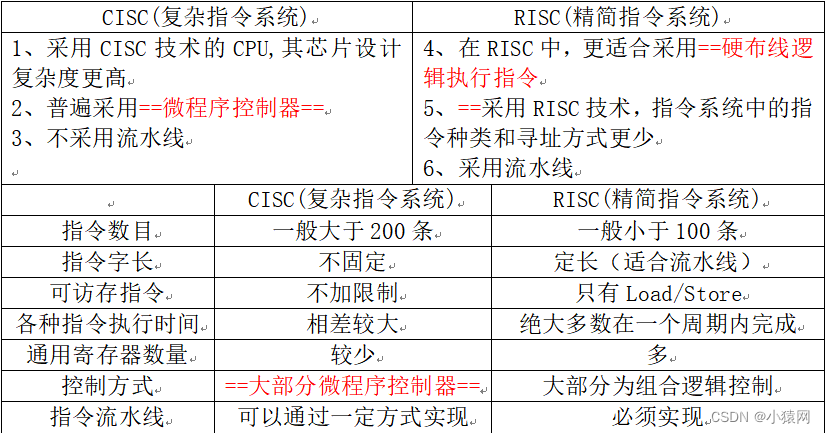

## 计算机分类

- 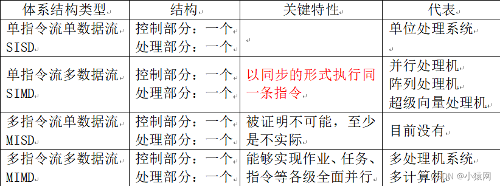

## 存储系统

### 硬盘

- 磁盘调度管理中，通常先进行移臂调度，再进行旋转调度

- SSD 固态硬盘的存储介质分为两种，一种是采用闪存（FLASH 芯片）作为存储介质，这种是主流。另 外一种是采用 DRAM 作为存储介质。

  - 闪存（Flash Memory）

    - 非易失性存储：即使在断电的情况下，闪存也能保持数据不丢失。

    - 读写速度：写入速度通常较慢，读取速度较快。

    - 耐用性：具有有限的写入次数，但比DRAM更耐用。

    - 用途：常用于USB闪存驱动器、固态硬盘（SSD）、智能手机和其他便携式设备。

    - 结构：由浮栅晶体管组成，数据存储在浮栅中。

  - 动态随机存取存储器（DRAM）

    - 易失性存储：断电后数据会丢失。

    - 读写速度：读写速度都很快，通常比闪存快。

    - 耐用性：DRAM不设计用于频繁写入，因为它依赖于电容来存储电荷，电容会随时间慢慢放电。

    - 用途：主要用于计算机的内存条，用于临时存储正在处理的数据和程序。

    - 结构：由一个晶体管和一个电容组成，数据存储在电容中。

  - DRAM通常用于系统的主内存，因为它能够快速地与CPU交换数据。而闪存则因其非易失性而被广泛用于长期存储数据的设备中。随着技术的发展，闪存的性能正在不断提高，固态硬盘（SSD）正在逐渐取代传统的硬盘驱动器（HDD），成为主流的存储解决方案。

### Cache

- Cache的功能：提高CPU数据输入输出的速率，突破所谓的“冯诺依曼瓶颈”，即CPU与存储系统间数据传送宽带限制

- 在计算机的存储体系中，Cache是访问速度最快的层次

- 使用Cache改善系统性能的依据是程序的局部性原理

- 如果以h代表Cache的访问命中率，t1表示Cache的周期时间，t2表示主存储器时间，以读操作为例，使用“Cache+主存储器”的系统平均周期为t3，则：

- t3=h×t1+(1-h)×t2

- 其中（1-h）又称为失效率（未命中率）

- Cache的设计思想是在合理成本下提高命中率

- Cache和主存之间的映射交换，由硬件自动完成。

### RAID技术

RAID （ Redundant Array of Independent Disks ）即独立磁盘冗余阵列，简称为「磁盘阵列」，其实就是用多个独立的磁盘组成在一起形成一个大的磁盘系统，从而**实现比单块磁盘更好的存储性能和更高的可靠性**。

- RAID 0磁盘利用率100%	(**至少需要两块硬盘，磁盘越多，读写速度越快，没有冗余。)**

  ​	它将多块磁盘组合在一起形成一个大容量的存储。当我们要写数据的时候，**会将数据分为N份，以独立的方式实现N块磁盘**的读写，那么这**N份数据会同时并发的写到磁盘中**，因此执行性能非常的高。

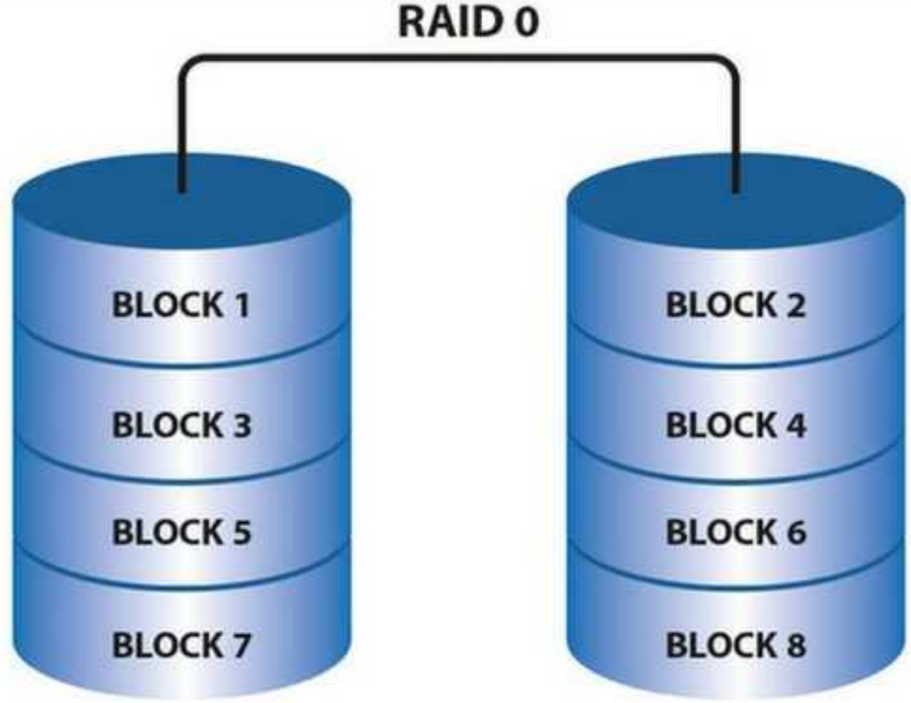

- RAID 1利用率50%       **(只能用两块硬盘，两块硬盘的数据互为镜像(写慢，读快)，一块磁盘冗余)**

​		因为它的原理是在往磁盘写数据的时候，**将同一份数据无差别的写两份到磁盘**，分别写到**工作磁盘和镜像磁盘**，那么它的实际空      	间使用率只有50%了，两块磁盘当做一块用，这是一种比较昂贵的方案

- RAID3的方式是
  - 将数据按照RAID0的形式，分成多份同时写入多块磁盘，但是还会另外再留出一块磁盘用于写「奇偶校验码」。例如总共有N块磁盘，那么就会让其中额度N-1块用来并发的写数据，第N块磁盘用记录校验码数据。一旦某一块磁盘坏掉了，**就可以利用其它的N-1块磁盘去恢复数据**。
  - **RAID 5或RAID 6磁盘阵列，使用了更为复杂的奇偶校验算法**，这些算法可以在一个或多个硬盘故障时恢复数据。RAID 5使用分布式奇偶校验信息，能够容忍一个硬盘的失败；而RAID 6则提供了双重奇偶校验，可以容忍两个硬盘的同时失败。

- RAID 5 磁盘利用率(N-1)/N，N最小取3        —–**奇偶校验算法**
  - **RAID5模式中，不再需要用单独的磁盘写校验码了。它把校验码信息分布到各个磁盘上。例如，总共有N块磁盘，那么会将要写入的数据分成N份，并发的写入到N块磁盘中，同时还将数据的校验码信息也写入到这N块磁盘中（数据与对应的校验码信息必须得分开存储在不同的磁盘上）**
  - **RAID 5使用分布式奇偶校验信息，能够容忍一个硬盘的失败；**
  -  **RAID5 是一种将 存储性能、数据安全、存储成本 兼顾的一种方案**

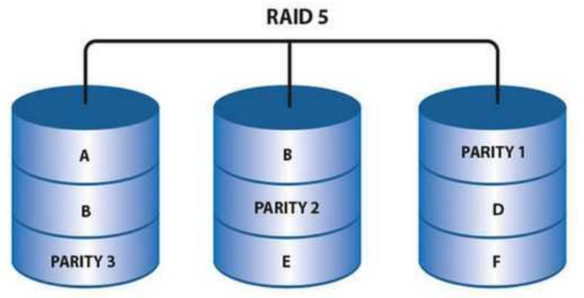

- RAID 6 磁盘利用率(N-2)/N，N最小为4。至少需要4块硬盘，2块磁盘冗余,硬盘的总数大于等于4即可

  - RAID 6则提供了双重奇偶校验，可以容忍两个硬盘的同时失败。

- RAID10：  RAID1 和 RAID0 的结合，先镜像再条带化

  - **RAID 10** 提供了更好的性能和更高的容错性，是更常用的选择。

  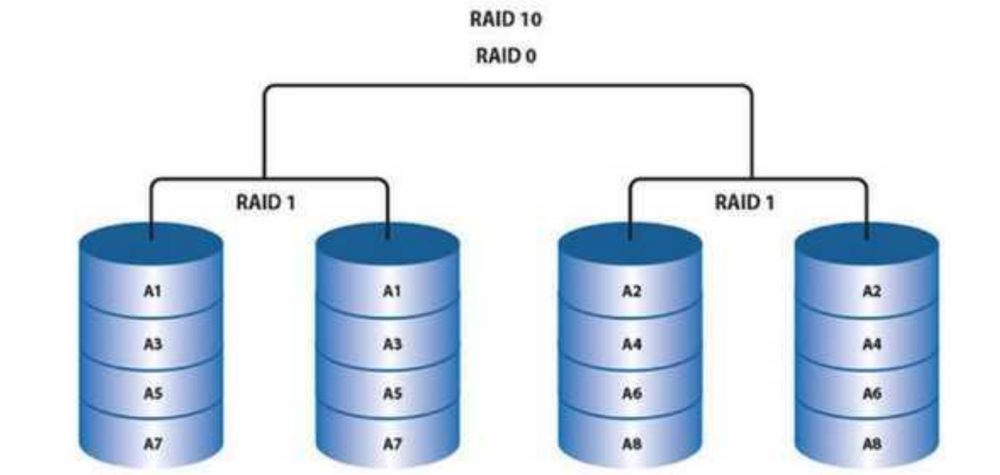

- **RAID 01** 虽然也能提供高性能，但在容错性方面不如 RAID 10，因此在实际应用中较少使用。

### 主存储器

- 主存储器简称为主存、内存，设在主机内或主机板上，用来存放机器当前运行所需要的程序和数据，以便向CPU提供信息。相对于外存，其特点是容量小速度快。

- 主存储器主要由存储体、控制线路、地址寄存器、数据寄存器和地址译码电路等部分组成。

- 计算机系统的主存主要是由（DRAM）构成

- 计算机采用分级存储体系的主要目的是为了解决存储容量、成本和速度之间的矛盾

- 随机访问存储器(RAM)有两类：静态的(SRAM)和动态的(DRAM), SRAM 比DRAM速度更快，但也贵得多。SRAM用来作为高速缓冲存储器(Cache), DRAM 用来作为主存及图形系统的帧缓冲区。

- EEPROM是电可擦除可编程只读存储器。

- SAN是一种连接存储管理子系统和存储设备的专用网络。SAN分为FC SAN和IP SAN，其中FC SAN采用光纤信道技术互联；IP SAN采用以太网技术互联；SAN可以被看作是数据传输的后端网络，而前端网络则负责正常的TCP/IP传输

### 存储系统的存储方式

- 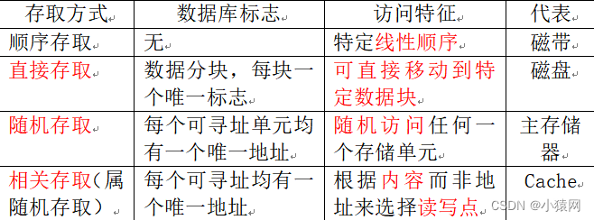

- 内部存储和外部存储

  - 常见的虚拟存储器由（主存-辅存）两级存储器组成

  - 栈区和堆区也称为动态数据区，全局变量的存储空间时候静态数据区

  - 一个运行的程序对应一个进程，需要相应的存储空间；一个进程可以包含一或多个线程

## 磁盘整列RAUD

- RAID0技术：

  - 可以同时对多个磁盘做读写动作，但不具备备份和容错能力，价格便宜，写入速度快，但是可靠性最差，磁盘利用率100%（条带）

  - 优缺点/领域：不会占用太多CPU资源设计、使用和配置比较简单；无冗余，不能用于对数据安全性要求高的环境；视频生成和编辑、图像编辑

- RAID1技术：

  - 使用磁盘镜像技术，使用效率不高，但是可靠性高,利用率为50%

  - 优缺点/领域：具有100%数据冗余；开销大，空间利用率只有50%在写性能反面提升不大；金融、财务等高可用、高安全的数据存储环境

- 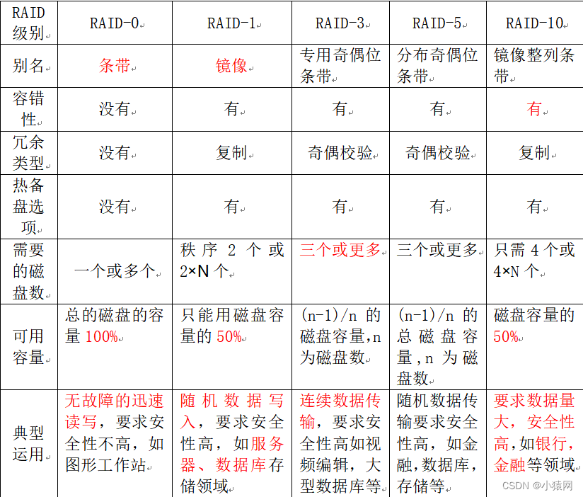

## 云计算与系统可靠性

### 云计算的模式主要有三种

- IaaS(基础设施即服务)

- SaaS(软件即服务)

- PaaS(平台即服务)

### 失效率

产生故障的概率。

### 平均无故障时间MTBF 

相邻两个故障间隔时间的平均值,越大越好。

### 平均故障修复时间MTTR 

修复一次故障所时间的平均值,越小越好。

### 可用性

系统的可靠性。

# 计算机组成原理

## 第一章计算机系统概述

### 计算机发展历程

#### **四代计算机变化**

1. 第一代**电子管**时代：逻辑元件使用电子管；使用机器语言进行编程
2. 第二代计算机使用**晶体管**：运算速度提高了。计算机软件得到了发展，出现了高级语言和编译程序
3. 第三代计算机：逻辑软件使用**中小规模集成电路**，操作系统也得到了发展，出现了分时操作系统。
4. 第四代计算机：采用了**大规模集成电路**，产生了微处理器，诸如并行，流水线，高速缓存和虚拟缓存这些概念用在了这代计算机中

#### **摩尔定律**

当价格不变时，集成电路上可以容纳的晶体管数目，每隔18个月就会增加一倍，性能也会提升一倍,

**微型计算机**的发展以微处理器技术作为标志

### 计算机的层次结构

#### 计算机系统的组成

**硬件系统和软件系统**共同构成了一个比较完整的计算机系统，硬件是指有形的物理设备，软件是指在硬件上运行的程序以及相关的数据和文档，一般而言，一个功能如果使用较为繁琐，则使用硬件来实现比较理想，使用硬件解决可以提高效率。

#### **冯 诺依曼基本设计思想**

- 采用存储程序的基本思想
- 按地址访问并顺序执行访问指令
- 采用控制流驱动方式
- 指令和数据以同等地位存储在存储器中，形式上没有区别，但是计算机可以区别他们。

#### 计算机硬件的功能部件

##### 输入设备和输出设备

键盘，鼠标，扫描仪，摄像机，显示器，打印机

##### 存储器

**地址寄存器（mar）**存放地址，经过地址译码后找到所选的存储单元。

**数据寄存器（mdr）**用于暂存要从存储器中读写的信息

mar用于寻址，其位数对应着存储单元的个数

mdr的位数和存储字长相等，一般为字节的2次幂的整数倍

##### 运算器

- 运算器中包含若干通用寄存器，用于暂存操作数和中间结果

- **累加器acc**。**乘商寄存器mq**。**操作数寄存器x   变址寄存器ix   基址寄存器br**

- **程序状态寄存器psw**

- 运算器中不包括地址寄存器，它在CPU中，但是并没有集成到CU或者运算器

##### 控制器：

- 程序计数器PC.：用来存放当前欲执行指令的地址，具体自动加一

- 指令寄存器IR 用来存放当前的指令 ，其内容来自MDR 

- 控制单元CU

- 指令寄存器对于用户是完全透明的MAR. MDR IR 这些都是CPU的内部工作寄存器，对程序员不可见

#### 计算机软件

- 系统软件和应用软件

  - **系统软件是保证计算机系统高效运行的软件**，比如**操作系统，数据库管理系统，语言处理程序，分布式软件系统**

  - 应用软件是指用户为解决某个应用领域中的各类问题而编制的程序，比如科学计算类，工程设计类

- 三个级别的语言

  - 机器语言：机器语言是计算机唯一可以直接识别和执行的语言

  - 汇编语言：较为低级的一种语言

  - 高级语言：计算机无法进行直接识别 

- 三种翻译程序

  - 汇编程序：将**汇编语言程序翻译成机器语言程序**

  - 解释程序：将源程序中的语言按照执行顺序逐条翻译成机器指令并执行，边解释边执行，速度比较慢

  - 编译程序：一次性全部编译，速度比较快

- **软件和硬件在逻辑上实现功能是等价的**

- 计算机的层次结构

  - 1.微程序机器层：由机器硬件直接执行微指令

  - 2.传统机器语言层：由微程序解释机器指令系统

  - 3.操作系统层：由操作系统实现

  - 4.汇编语言层：为用户提供一种符号化的语言

  - 5.高级语言层：面向用户

- 从源文件到可执行文件

  - **预处理：对#开头的命令进行处理。生成.I文件**

  - **编译：对预处理的源程序进行编译，生成汇编程序.s**

  - **汇编：翻译为机器语言指令，生成.o文件**

  - **链接阶段：将多个可重定位文件和标准库函数合并生成一个可执行文件**

- 计算机的性能指标

  - 字长：一般等于内部寄存器的大小

  - 数据通路带宽：数据总线一次所能并行传输信息的位数

  - 主存容量：MAR的位数反应了存储单元的个数  MDR的位数反应了存储单元的位数

  - 主频：机器内部主时钟的频率，主频越高，完成一个指令所用的时间越短

  - CPU时钟周期：主频的倒数，CPU中最小的时间单位

  - CPI执行一条指令所需要的时钟周期数

  - CPU执行时间：（指令条数*CPI）/主频

  - MIPS=主频/（$CPI*10^6$）

  - MFLOPS.    GFLOPS TELOPS. PELOPS. EFLOPS ZFLOPS从六次开始依次加3

  - 基准程序：是用来评价性能的一组程序，可以很好的反映机器在运行时负载的性能，但是会有一些缺陷，开发人员可能会针对一些代码片段进行特殊优化

  - 从用户角度来看，评价计算机系统性能的综合指标是吞吐率。

## 第二章 数据的运算

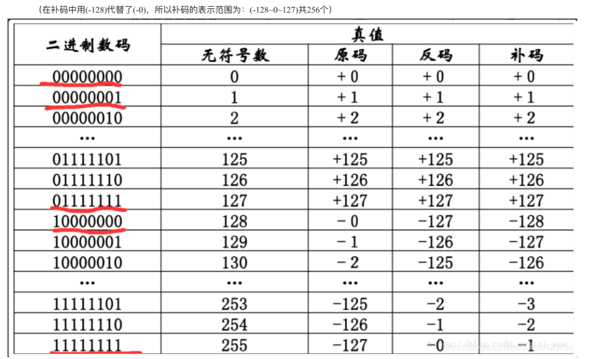

## 第三章 存储器

### 存储器的分类

- 按在计算机中的作用分类

  - 主存储器

  - 辅助存储器

  - 高数缓冲存储器

- 按存储介质分类

  - 磁表面存储器 比如磁盘 磁带

  - 磁芯存储器 

  - 半导体存储器

  - 光存储器 比如光盘

- 按存取方式分类

  - **随机存储器**，其特点是存储器的任何一个存储单元都可以随机存取 并且存储时间与存储器单元的物理位置无关 RAM又分为动态RAM和静态RAM。

  - **只读存储器** 存储器的内容只能随机写入但是不能读出 通常存放固定不变的程序 常数和汉字  

  - **串行访问存储器** 对存取单元进行读写操作的时候 要按照物理位置的先后进行寻址 包括顺序存取存储器 与直接存取存储器 **比如光盘 磁带属于顺序存取存储器SAM**。 
  - 磁盘属于**直接存取存储器DAM**

- 按信息的可保存性分类

  - 断电后存储信息消失的存储器称为**易失性存储器**

  - 断电后信息保持的存储器称为**非易失性存储器**

### 存储器的性能指标

- 存储容量：存储字数❌字长

- 单位成本：每位价格=总成本/总容量

- 存储速度：数据传输率=数据的宽度/存取周期

  - 注意 存取周期不等于存取时间 这是因为对于任何一种存储器 在进行一次完整的存取操作之后 都需要一定的休整时间 存取周期往往比存取时间大的多

  - 存取时间：是指从启动一次存储器操作到完成该操作所经历的时间

  - 存取周期：又称存取周期 或者访问周期 是指存储器进行一次完整的读写操作所经历的时间间隔

  - 主存带宽：又称为数据传输率，表示每秒主存进出信息的最大数量

### 多级层次的存储管理系统

- cache—主存层

  - 主要是为了解决主存速度与cpu速度不匹配的问题

  - cache的常见问题

    - cache的使用原理 程序的局部性原理 时间局部性是指在最近的未来要用到信息 很可能是正在使用的信息 因为程序中存在循环 空间局部性是指在最近的未来要用到的信息 很可能与现在正在使用的信息在存储空间上是邻近的 因为指令通常是顺序存放 顺序执行的 

    - cache本质上就是cpu缓存 通常由SRAM构成 

    - cache块大小通常与存储块大小一致

    - 当cpu发出写请求的时候 如果cache'命中 有可能会遇到cache与主存中的内容不一致的问题 比如cpu写cache 把cache中的内容由x改为y 但是对应主存中的内容依然是x 没有发生改变 这种情况下就要进行cache写回

      - 直写法 当cpu对cache进行写命中时 必须把数据同时写入cache和主存 当某一块需要替换的时候 不必把这一块写回主存 用新调入的块进行覆盖即可 但是这样的方法增加了访存次数    为了解决这个问题 可以增加一个写缓冲队列 cpu同时将数据写入到cache和写缓冲中 写缓冲再将内容写入主存 写缓冲是一个fifo队列 写缓冲可以解决速度不匹配的问题 但是当频繁写的时候 写队列会发生溢出 所以这种方法并不是很好的方法。由于这种方法不需要标记是否发生修改 所以并不存在脏位
        - 对于直写法 当cache不命中时采取非写分配法只写入主存 不进行调块

      - 写回法，这种方法cpu在进行访存的时候，只对cache进行修改 ，只有当这块需要被换出的时候才会进行换出，这个时候可以减少写回主存的开销 修改位为1表明cache被修改过 替换的时候需要写回主存，那么对于这种方法进行写的操作就需要设置一个脏位
        - 当cache不命中的时候 进行写分配法 加载主存中的块到cache上 然后更新这个cache块

    - cache主存块的映射方法

      - 全相连

      - 组相连

      - 直接映射

    - cache的替换算法

      - 随机算法

      - 先进先出算法 容易出现抖动

        - 需要替换位的计算 直接映射的替换为是log_2(行数)

        - 替换位的计算 组相联的替换位是log_2(分组数)

      - 最近最少使用算法
        - 替换位的计算和fifo算法一致

- 主存-辅存层
  - 主要解决存储系统的容量问题 

- 一些常见关系

  - 在存储体系中 cache 主存可以直接与cpu交换信息 但是辅存需要通过主存与cpu交换消息

  - 主存与cpu cache  辅存都可以交换消息

  - 主存和cache之间的数据调动是由硬件自动完成的 对于所有程序员都是透明的 主存和辅存之间的数据调动是由硬件和操作系统来完成的对于应用程序员是透明的 但是对于一些底层程序员是可见 可修改的

### 主存储器

- SRAM的工作原理 是静态随机存储器 存取速度快 信息被读取之后 需要保持原状态 不需要再生  SRAM的存取速度快 但是集成度比较低 功耗较大 一般作为高速缓冲存储器 一般有一个双稳态触发器
  - SRAM工作的时候不需要刷新

- DRAM 动态随机存储器 是利用存储愿电路栅极电容上的电荷来存储信息的。相对于SRAM来说 DRAM具有集成度高 价格低 容量大的优点 但是DRAM的存取速度要比SRAM的慢 一般用于大容量的主存系统 是破坏性读出

  - DRAM可以使用地址引脚复用技术 行地址和列地址通过相同的引脚前后两次输入 这样地址引脚数可以减少一半 采用地址复用

  - DRAM的刷新按行进行

- 只读存储器

  - 首先要明确的一点是 ROM和RAM都是支持随机存储访问的存储器  但是SRAM和DRAM都是易失性半导体 一旦有了信息 就不能轻易改变

  - ROM结构简单位密度比可读写存储器高，具有非易失性 可靠性高

  - ROM的类型

    - MROM 按用户提出的要求 在芯片的生产过程中直接写入 写入之后无法改变

    - PROM 实现一次可编程

    - EPROM 可以对内容进行多次修改 但是远远不如RAM 是因为EPROM的编程次数是有限的 

    - FLASH存储器 是在EPROM的基础上发展起来的 主要特点是可以在不加电的情况下保存信息

    - 固态硬盘 由控制单元和存储单元组成 保留了flash的长期保存信息 快速擦除的特点  对比传统硬盘具有读写速度快 低功耗的特点 但是价格比较高

## 第四章指令系统

#### 指令的基本格式

- 操作码 
  - 指出应该执行什么样的操作 以及具有何种功能 操作码是识别指令 了解指令功能 以及区分操作数地址内容的组成和使用方法的关键信息

- 地址码
  - 给出被操作信息的地址 包括参与运算的一个或者多个操作数所在的地址

- 指令分类

  - 零地址指令
    - 只需要给出操作吗op 比如空操作指令 停机指令 关中断指令

  - 一地址指令
    - 进行操作之后 结果返回原地址
      - 比如加1减1 取反 求补

  - 二地址指令
    - 要求使用两个操作数 给出目的操作数和源操作数 还要将结果存放在目的操作数中 其中目的操作数用来存放本次运算的结果
      - 常用的逻辑和算数运算命令就是二地址指令 需要访问四次内存 取指一次 读a1 读a2 将结果写回a1

  - 三地址指令
    - （a1）op（a2）——->a3
      - 需要访问四次存储器

  - 四地址指令
    - (a1)op(a2)—->a3,a4
      - a4是指下一条指令的地址

#### 指令的操作类型

- 数据传送类

  - mov

  - load

  - store

- 算数和逻辑运算
  - 加      减           乘除           比较        加一              取反         异         或等等

- 移位操作

- 转移操作

  - 无条件转移 jmp

  - 有条件转移 jup

  - 条件转移branch

  - 调用call

  - 返回 ret

  - 陷阱 trap

  - 注意转移和调用的区别 转移指令不返回执行 调用指令会返回执行

- 输入输出操作
  - 这类指令用来完成cpu与外部设备交换数据或者传送控制命令以及状态信息

#### 什么是指令系统

- 一台计算机所有指令的集合构成该系统的指令系统，也就是指令集

- isa规定的指令系统包括指令格式 数据类型和格式 操作数的存放方式 程序可访问的寄存器个数 位数和编号 存储空间的大小和编制方式 寻址方式 指令执行过程中的控制方式

##### 各种字长之间的比较

- 指令字长 是一条指令的总长度

- 机器字长是cpu进行一次整数运算所能处理的位数 机器字长一半等于内部寄存器的大小 它决定了计算机的运算精度 比如windows 32位64位 这里的32位 64位就是该操作系统的机器字长

- 存储字长是一个存储单元中二进制代码的位数，某某计算机按照字节编制 说明该计算机的存储字长为1B 八位

- 机器字长和存储字长 两者没有必然的联系

- 机器字长和存储字长 没有必然联系 指令字长可以等于机器字长 也可以大于或者等于 通常把等于机器字长的指令称为单字长指令 等于半个机器字长的指令称为半字长指令 等于两杯机器字长的指令称为双字长指令

- 存储字长和指令字长 通常为了方便取址 规定指令字长为存储字长的整数倍 现在的计算机指令长度基本都是存储字长的整数倍

#### 指令的寻址方式

- 有时候指令中的地址码字段不代表操作数的真实地址 这种地址称为形式地址 形式地址结合寻址方式 可以计算出操作数载存储器中的真实地址 这种地址称为有效地址EA

- 顺序寻址 通过pc+1来形成下一条指令的地址

- 跳跃寻址  下一条指令的地址并不由pc给出 而是本条指令给出下条指令的计算方式 跳跃的结果是修改当前pc值

- 数据寻址 是指如何在指令中表示一个操作数的地址 

  - 隐含寻址 不给出操作数的地址 而是在指令中隐含操作数的地址  隐含地址的优点是有利于缩短指令字长 缺点是需要增加存储操作数或者隐含地址的硬件

  - 立即数寻址 给出的字段不是操作数的地址 而是操作数本身  立即数寻址的优点是在指令执行阶段不访问主存 指令执行时间最短

  - 直接寻址 
    - 简单 指令在执行阶段仅访问一次主存 不需要专门计算操作数的地址，给出的地址就是操作数的地址

  - 间接寻址
    - 给出的形式地址不是操作数的有效地址 而是操作数地址的地址
      - 这种寻址方式间接扩大了寻址范围 

  - 寄存器寻址
    - 是指在指令字中直接给出操作数所在寄存器的编号 
      - 优点是在执行阶段不访问主存 只访问寄存器  对应的地址码长度较小 使得指令字短并且不用访问主存 所以执行速度快 支持向量运算 缺点是寄存器价格比较昂贵 也就是说 操作数直接在寄存器里面

  - 寄存器间接寻址

    - 给出的不是一个操作数 而是操作数所在主存单元的地址

      - 寄存器间接寻址会比一般的间接寻址更快一点 但是指令的执行阶段需要访问主存

      - 间接寻址扩大了寻址范围

  - 相对寻址

    - 是把pc的内容加上指令格式中的形式地址A   EA=pc+A

      - 相对寻址的优点是操作数的地址不是固定的 随pc值的变化而变化  相对寻址广泛用于转移指令

      - 注意 对于转移指令jmp A 当cpu从存储器中取出一字节时，会pc+1 若转移指令的地址为x 并且占2b 在取出该指令后 pc的值会增2 pc=x+2 这样在执行完指令之后 程序会自动跳转到x+2+a的地址继续执行

      - 相对寻址实际上是以下条指令在内存中首地址为基准的偏移量

  - 基址寻址
    - EA=(BR)+A
      - 基址寄存器是面向操作系统的  用户可以决定哪个寄存器作为基址寄存器 但是内容仍然由操作系统决定
        - 基址寻址的优点是扩大寻址范围 用户不必考虑自己的程序存于主存的哪个区域 有利于多道程序设计 可用于编制浮动程序 但是偏移量比较短

  - 和基址寻址相对的变址寻址

    - 指令字中的形式地址A加上变址寄存器的内容之和

      - 变址寄存器是面向用户的 在指令执行过程中  变址寄存器的内容可以由用户改变 形式地址不变

      - 需要区分变址寻址和基址寻址的不同 对于变址寻址  变址寄存器的内容是可以改变的 但是指令字中的形式地址a是不变的

      - 但是对于基址寻址，基址寄存器的内容是由操作系统决定的，在程序的执行过程中，基址寻址器的内容不可以改变，有利于设计多道程序设计

  - 堆栈寻址

    - 堆栈是存储器中一块特定的 按先进先出原则管理的存储区  该存储区中读写单元的地址是用一个特定的寄存器给出的 该寄存器称为堆栈指针 

      - 软堆栈：从主存中划出一部分作为堆栈是最合算也最常用的方法 

      - 寄存器堆栈也叫做硬堆栈  虽然成本较高 但是在访问过程中不需要访问主存

- 寻址方式的多少对于一个指令系统来讲有什么影响

  - 对于一个系统 寻址方式的多样化可以让用户编程更加方便 但是多重寻址会造成cpu结构的复杂化 不利于指令流水线的运行

  - 寻址方式太少虽然可以提高cpu的效率 但是对于用户来说 少数寻址方式会使编程变得复杂

#### 指令的机器级代码表示

- 

#### cisc和risc的基本概念以及区别

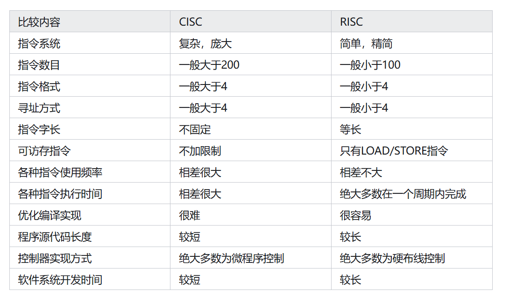

#### 实现指令流水线的基础

- 指令**长度规整并且长度一致**

- 指令和数据按照边界对齐存放

- 只有**load和store指令才能对操作数进行访问**

## 第五章 中央处理器

### cpu的基本结构和功能

- cpu
  - cpu由**运算器和控制器**组成。   

- 基本功能
  - 指令控制 操作控制  时间控制  数据加工  中断处理

- 运算器

  - 运算器的功能是负责对数据进行加工

  - 运算器构成：算数逻辑单元（ALU）暂存寄存器 累加寄存器（ACC） 通用寄存器组  程序状态寄存器（PSW）psw是对用户可见的 移位器  计数器（CT）

  - 运算器中使用到的寄存器 算数逻辑单元。暂存寄存器 累加寄存器  通用寄存器组  程序状态寄存器  移位器  计数器

- 控制器

  - 控制器的功能是负责协调并控制计算机各个部件的指令序列。包括取指令 分析指令 执行指令。

  - 控制器的基本操作是执行指令：包含 程序计数器（PC 跟踪后续指令地址的寄存器）指令寄存器（IR 保存当前正在执行的指令）指令译码器 存储器地址寄存器  存储器数据寄存器  时序系统和微操作信号发生器

  - 控制器的有硬布线控制器RISC和微程序控制器CISC两种

  - 程序计数器pc。指令寄存器ir

### 基本结构

- 对于程序状态字寄存器多说几点：其中包含溢出标志（OF）符号标志（SF）零标志（ZF）进位标志（CF）

- 对于用户可见的寄存器：pc  psw  acc 通用寄存器 可以这样理解 可以进行汇编语言编程的就是可见的寄存器

- 对于用户不可见的寄存器：MAR MDR IR 指令寄存器

- 所谓的n位寄存器中的n是指数据总线数

- 程序计数器的位数取决于存储器的容量

- 通用寄存器的位数取决于机器字长

- 指令译码是对指令的操作码字段进行译码 

- 地址译码器在内存中

- 间址的作用是取操作数的有效地址 所以间址结束时 cpu内mdr的内容为操作数地址

- cpu的程序计数器存放的是指令地址

### 基本功能

- 取指周期是为了取指令 MAR存放指令地址 MDR存放指令内容

- 间址周期是为了取有效地址 MAR存放指令地址码 MDR存放操作数的有效地址 是通过数据总线传输的

- 执行周期是为了取操作数

- 中断周期是为了保存程序断点。MAR存放栈顶指针SP MDR存放断点 也就是当前指令的地址 注意中断周期是在指令执行结束之后

### 数据通路的基本结构和功能

- 数据在功能部件之间传送的路径称为数据通路。包括数据通路上流经的部件。比如ALU 通用寄存器 状态寄存器  异常和中断寄存器 

- 数据通路的基本结构：

  - CPU内部单总线方式 结构比较简单  一个时钟只允许一个操作 无法完成指令的所有操作，所有寄存器的输入输出端都在一条线上 如果要进行加减乘除 就需要暂存器

  - CPU内部多总线方式：同时传送不同的数据。提高效率

  - 专用数据通路方式：根据指令执行过程中的数据和地址的流动方式安排线路 避免使用共享的总线 性能较高 但是硬件数量比较大

- 寄存器之间的数据传送 比如：（PC）- MAR 这里的意思是 将PC中的内容传送到MAR中

- 主存与CPU之间的数据传送：（PC）- MAR ；1-R；MEM（MAR）- MDR；（MDR）- IR

- 执行算数或者逻辑运算:(MDR)->MAR. （这里是将指令的地址码送到MAR）    MEM(MAR)->MDR.      (MDR)->Y.        (ACC)+(Y)->Z        (Z)->ACC

- 取指结束后 MAR存放的是指令的地址  MDR存放的是指令的内容

- 间指结束后  MAR存放的是指令的地址码 MDR存放的是操作数的有效地址

- 数据通路不包括控制器，控制部件根据每条指令功能的不同生成对数据通路的控制信号

- 控制器的功能和工作原理

  - 控制器是计算机系统的指挥中心，控制器的主要功能为：

    - 从主存中取出一条指令，并指出下一条指令在主存中的位置

    - 对指令进行编码或者测试，产生对应的操作控制信号，以便启动规定的动作

    - 指挥并控制CPU主存，输入和输出设备之间的数据流动方向。

### 各种周期

- CPU上的读写控制信号的作用是：决定数据总线上的数据流方向  控制存储器的读写类型。控制流入流出存储器信息的方向

- 时钟周期 最小的cpu单位

- 指令周期  cpu从主存中取出并且执行一条指令的时间叫做指令周期

- 机器周期  是指一个指令的一个阶段所需的时间 不要将cpu处理完一个机器字长数据所用的时间当作机器周期 两个时间是没有必然联系的

- 总的来说 指令周期包含多个机器周期(这个很好理解 因为一个指令包含取指 间指 中断 执行四个方面 )，一个机器周期包含多个时钟周期

- 指令字长一半是存储字长的整数倍 如果是两倍 则需要两次访存 ，如果指令字长等于存储字长 那么取指周期等于机器周期

- 存取周期 两个存取操作所需要的时间间隔叫做存取周期 在计算机中 通常使用存取周期来确定机器周期 也就是说机器周期等于存取周期

- http://t.csdn.cn/vbqCq

### 控制器的功能和工作原理

- 硬布线控制器

  - 输入

    - 经过指令译码产生的指令信息

    - 时序系统产生的机器周期信号和节拍信号

    - 来自执行单元的反馈信息 也就是标志

  - 输出
    - 一个机器周期内完成若干相容的微操作

  - 控制方式

    - 同步控制方式
      - 有统一的时钟信号

    - 异步控制方式

      - 不存在基准时标信号 各个部件按照自身固有的速度工作 通过应答方式进行联络

      - 速度很快 但是控制电路比较复杂

    - 联合控制方式
      - 介于两者之间 大部分采用同步 小部分采用异步

  - 设计步骤

    - 分析操作序列

    - 选择cpu方式
      - 定长 节拍数

    - 安排时序
      - 哪个操作在哪个节拍

    - 电路设计
      - 先写出最简表达式

  - 特点
    - 硬布线控制器速度比较快 但是电路比较复杂 改动很困难

- 微程序控制器

  - 基本概念

    - 指令=微程序>微指令>微操作=微命令

    - 微周期：微指令的周期

  - 组成

    - 微地址形成部件
      - 由op操作码形成初始微地址

    - 顺序逻辑
      - 根据CMDR下地址 标志和CLK生成微地址

    - 微地址寄存器
      - CMAR

    - 控制存储器

      - 存放微程序 在CPU内部 由ROM实现

      - n条指令 至少n+1个微程序（公共的取指）
        - 可能还有公用的中断 间址

      - 除执行周期外的微指令序列通常公用

    - 微指令寄存器
      - CMDR

  - 微指令

    - 格式

      - 水平型微指令
        - 一条微指令定义多个相容的微命令

      - 垂直型微指令

        - 一条微指令定义一个相容的微命令

        - 慢

      - 混合型微指令
        - 都有

    - 编码方式/控制方式

      - 是指如何对微指令的控制字段进行编码 形成控制信号

        - 直接编码
          - 每个1/0对应一个微命令 简单直观 执行速度快 但是微指令字长过长

        - 字段直接编码方式

          - 互斥性命令放在同一个字段内 相容性微命令放在不同段内

          - 每个小段中的信息位不能太多 否则将增加译码线路的复杂性和时间

          - 每个小段还要留出一个状态 表示字段不发出任何微命令

        - 字段间接编码方式
          - 一个字段的微命令需要由另一个字段中的某些命令来解释 由于不是直接靠字段直接译码发出的微命令 所以称为字段间接编码

    - 地址形成方式

      - 由下地址给出
        - 断定方式

      - 由操作码形成

      - 增量计数器法
        - CMAR+1——->CMAR

      - 分支转移
        - 判别条件+转移地址

      - 通过测试网络
        - 顺序逻辑部件

  - 设计步骤

    - 分析微操作序列

    - 写出对应微操作以及节拍安排
      - 注意每个微指令后特有的地址形成节拍

    - 确定微指令格式
      - 操作码 下地址

    - 编写微指令码点

  - 其他

    - 动态微程序设计
      - 使用EPROM

    - 毫微程序设计
      - 不用微程序直接控制而是由存放在第二级控制器中的豪微程序来解释的 其实是一个大的套娃

- 比较

  - 硬布线控制器

    - 速度快  繁琐不规整 

    - 拓展性比较差

    - 微操作控制信号由组合逻辑电路根据当前的指令码 状态和时序 即时产生

  - 微程序控制器

    - 执行速度比较慢 但是比较规整

    - 微操作控制信号以微程序的控制形式存放在控制存储器中 执行指令时读出即可

    - 适用于CISC

    - 比较容易扩充修改

    - 时序系统比较简单

    - 机器指令的操作码字段形成微程序的入口地址

    - 微程序控制存储器属于cpu的一部分

    - 取指令操作是控制器固有的功能 不需要在操作码的控制下进行

- 异常和中断的处理过程

  - 各个部分处理异常的机制

    - 在cpu数据通路中，设有相应的异常检测和响应逻辑

    - 在外设接口中 有相应的中断请求和控制逻辑

    - 操作系统中有相应的中断服务程序

    - 这些中断硬件和中断服务程序有机结合 共同完成异常和中断的处理过程

  - 异常和中断的基本概念

    - 异常

      - cpu内部产生的意外事件称为异常 有些教材也称为内中断，是指cpu执行一条指令时，在cpu内部检测到的 与正在执行的指令相关的同步事件

      - 程序性异常

        - 故障

          - 是指引起故障的指令启动后，执行结束前被检测到的异常事件

          - 指令译码之后出现非法操作码

          - 取数据时出现缺段或者缺页
            - 将需要的段调入主存，回到发生故障的指令继续执行，断点为当前发生故障的指令

          - 执行整数除指令发现除数为0
            - 无法通过异常处理程序来恢复故障，所以不能回到原断点执行，必须终止进程的执行

        - 自陷

          - 概念：预先安排的一种异常事件，当执行到了被设置的陷阱的命令时，cpu在执行完自陷指令后，自动根据不同的陷阱类型进行不同的处理，然后返回到自陷指令的下一条指令执行

          - 当自陷指令是转移指令时，并不是返回到下一条指令执行，而是返回到目标指令执行

          - 断点设置 系统调用 条件自陷都属于陷阱指令，执行到这些指令的时候，无条件或有条件的自动调出操作系统内核进行执行

      - 硬故障中断

        - 控制器出错

        - 存储器效验错

        - 不是由特定指令发生的，而是随机发生的，出现了这种错误，只能调出中断服务程序来重启系统。

    - 中断

      - 来自cpu外部的向cpu发出的中断请求叫做中断，用于信息的输入和输出，是一种典型的由外部设备触发的，与当前正在执行的指令无关的异步事件

      - 可屏蔽中断
        - 通过可屏蔽中断请求线INTR向CPU发出的中断请求，可以用过设置相应的屏蔽字来选择屏蔽它或者不屏蔽它

      - 不可屏蔽中断
        - 通过专门的不可屏蔽中断线向NMI,比如电源掉电等故障

    - 区别

      - 缺页和溢出等异常事件是由特定指令在执行过程中产生的，中断不和任何指令关联，不阻止任何指令的完成

      - 异常的检测必须由cpu自身来完成，但是对于中断，必须通过中断请求线来获取中断源的信息，才能知道哪个设备发生了哪种中断

  - 异常和中断的响应过程

    - 关中断
      - 禁止响应新的中断，设置中断允许触发器来实现

    - 保存断点和程序状态
      - 保存PSW

    - 识别异常和中断并转到对应的处理程序

      - 软件识别
        - 设置一个cpu异常状态寄存器，用于记录异常原因，先查询到的先处理，然后转到内核中相应的处理程序

      - 硬件识别
        - 向量中断，所有中断向量都存放在一个中断向量表中，每个异常或者中断都被指定一个中断类型号，整个响应过程是不可被打断的，这部分任务是由cpu执行中断服务程序来完成的

### 指令流水线

- 基本概念

  - 指令集：RISC

  - 表示方式

    - x时间。 y阶段 时空图

    - x时间单元 y指令  流程图 分析影响因素

  - 装入时间和排出时间
    - 第一个最后一个任务进入到输出的时间

  - 分类

    - 部件功能级（运算）处理机级 处理时间

    - 单功能（专门功能） 多功能

    - 线性 非线性（有反馈）

  - 性能指标

    - 吞吐率

    - 加速比
      - t（不用流水线）/t（用流水线）

    - 效率。时空图上的 有效面积/总面积

- 基本实现

  - 特点

    - 定长机器周期
      - 取最长的那个

    - 不用的阶段也消耗时间

  - 过程

    - IF
      - 指令Cache

    - ID
      - 寄存器

    - EX，执行，计算地址
      - ALU

    - M
      - 数据Cache

    - WB

  - 指令类型

    - 运算类指令
      - M阶段空段

    - load，访存指令，需要经过EX阶段计算

      - ID阶段仅取出基址寄存器的值和偏移量

      - M阶段取出目的数到锁存器

      - WB阶段取出的数写回寄存器

    - store，访存指令，需要经过EX计算

      - ID阶段取出所有的3个需要的数据

      - M阶段写回

      - WB阶段空段

    - 条件转移，使用相对寻址 ，pc修改越早，越不容易发生控制冲突
      - M段修改pc，wb空段

    - 无条件转移，上同
      - EX修改PC，M和WB空段

- 结构冒险，数据冒险和控制冒险的处理

  - 资源冲突
    - 解决方案：数据cache，指令cache分离

  - 控制冲突

    - 原因
      - 转移，调用，返回会修改pc，造成断流

    - 数据冲突

      - 分类

        - 写后读RAW
          - 按序执行唯一可能遇到的

        - 读后写WAR

        - 写后写WAW

      - 解决

        - 硬件阻塞，软件插入NOP

        - 数据旁路技术
          - 设置专用通路

        - 编译优化
          - 调整指令顺序

    - 解决

      - 分支预测

        - 静态预测
          - 先默认yes，不是再返回

        - 动态预测
          - 根据历史情况进行预测

      - 预取两个方向的目标指令

      - 提前形成条件码

      - 提高猜准率

  - 考试相关

    - 画出流程图，分析阻塞相关

      - 数据相关RAW

      - 资源冲突

- 超标量和动态流水线的基本概念

  - 超标量

    - 原理

      - 同时启动多条指令

      - 指令打包和冒险处理
        - 任务

      - 指令预取，分派器，多个功能单元
        - 组成

      - 可以采用动态调度技术提高指令执行并行性

    - 超长指令字技术

      - 利用编译优化挖掘并行性

      - 空间换时间

      - cpi<1

- 超流水线技术

  - 原理
    - 增加流水线级数 对应的缩短时钟周期

  - 特点

    - 流水段越多 时钟周期越短，指令吞吐率越高

    - cpi=1

- 动态流水线

  - 把后面的挪到前面的空位

  - 多种运算同时进行，模块利用率比较高

### 多处理器

- SISD SIMD MIMD 向量处理器

  - SISD，单指令，单数据流结构

    - 特点
      - 并发不能并行

    - 硬件 
      - 处理器，主存

  - SIMD，单指令，多数据流结构

    - 特点

      - 多条数据做同一个操作比如显卡

      - 数据级并行技术

    - 硬件

      - cu 主存仅一个 但是执行单元多个

      - 各个执行段缘各自有各自的寄存器组，局部寄存器，MAR

  - MIMD，多指令，多数据流

    - 特点

      - 多指令多数据

      - 线程级并行，甚至以上

    - 分类

      - 多处理器系统

        - 特点
          - 可以用load访问一个主存，通过主存交流

        - 硬件
          - 共享物理空间

        - 又名
          - 共享内存处理器，多核处理器

      - 多计算机系统

        - 特点
          - 只能通过消息传递交流

        - 硬件
          - 不共享物理空间

  - 向量处理器

    - 特点

      - 数据对象是向量

      - 删除并行计算，浮点数处理，常用于超算

    - 硬件
      - 多处理器，多向量寄存器

    - 主存

      - 主存采用多端口同时读的交叉多模块存储器

      - 大容量，集中式

- 硬件多线程

  - 实现

    - 配备多个通用寄存器和pc，线程切换时激活其中一个

    - 线程所需资源不冲突时，可以并行执行

    - 硬件多线程是在一个cpu上处理多个线程，可以用于单核处理器

  - 分类

    - 细粒度多线程

      - 多线程之间指令不相关，可以乱序并发

      - 每个时钟周期都可以切换线程

    - 粗粒度多线程

      - 引入流水线，切换时要清空整条流水线，开销比较大

      - 仅开销阻塞时切换

    - 同时多线程

      - 指令发射槽并行

      - 指令级并行+线程级并行
        - 注：另外两个仅仅有指令集并行

- 多核处理器

  - 一个cpu有多个运算核心

  - 可以有各自的cache，也可以共享cache

- 双核cpu和超线程cpu

  - 会出现争抢资源的情况

  - 能同时执行两个运算

  - 双核是在一个cpu上集成两个运算核心

- 共享内存多处理器

  - 和前这一个东西都是MIMD

  - 所有核共享主存和LLC

  - NUMA构架比UMA构架的运算拓展性要强

  - UMA构架需要解决的问题是Cache一致性

## 第六章 总线

### 总线的定义

总线是一组能为多个部件分时和共享的公共信息传送线路

- 分时和共享是总线的两个特点

- 分时是指同一时刻只允许有一个部件向总线发送信息

- 共享是指总线上可以挂多个部件 各个部件之间交换的信息都可以通过这组线路分时共享

- 系统使用总线便于增减外设，同时减少信息传输线的条数

### 总线设备

​	总线上所连接的设备 

- 主设备：获得总线控制权的设备

- 从设备：指被总线访问的设备 他只能响应从主设备发来的各种命令

### 总线的分类

- 片内总线：是芯片内部的总线，是内部寄存器与寄存器之间，寄存器与ALU之间的公共连接线

- 系统总线：计算机系统内各个功能部件之间（CPU 主存 IO接口）相互连接的总线，按照系统总线传输内容的不同，分为数据总线，地址总线和控制总线。

  - 数据总线用来传输各个功能部件的数据信息，比如指令，操作数，中断类型号，他是双向传输总线，其位数与机器字长，存储字长有关，比如间址寻址第一次访问内存所得到的信息就由数据总线传送到CPU

  - 地址总线用来指出数据总线上的源数据或目的数据所在的主存单元或者IO端口的地址，他是单向传输总线，地址总线的位数与主存地址空间的大小有关

  - 控制总线传输的是控制信息，包括CPU送出的控制命令和主存（包括外设）返回cPU的反馈信号，比如握手信号。

  - 注意区分数据总线和数据总线，各个功能部件通过数据总线连接形成的数据传输路径称为数据通路。数据通路是数据流经的路径，而数据总线是承载的媒介

- IO总线主要用于连接中低速的IO设备，通过IO借口与系统总线连接，目的是将低速设备和高速设备分离，常见的有USB PCI总线

### 通信总线

是在计算机系统之间或计算机与其他系统之间传送信息的总线，按照时序控制方式可以将总线划分为同步总线和异步总线，按照数据传送方式可以将总线划分为并行总线和串行总线

### 系统总线的结构

- 单总线结构：所有设备都挂在一组总线上，允许IO设备之间，IO设备和主存之间直接交换信息，单总线并不是只有一条信号线，系统总线按照 传送信息的不同可以细分为地址总线，数据总线和控制总线。单总线的结构简单，成本低，易于接入新的设备。

- 双总线结构：一条是主存总线，用在cpu，主存和通道之间传送数据，另一条是IO总线，用在多个外部设备与通道之间传送数据；将低速IO设备从单总线上分离出来，实现了存储器总线和IO总线分离

- 三总线结构：分别为 主存总线  IO总线。和直接内存访问总线

### 一些总线标准

- USB属于串行总线

- 在现代微机主板上，采用局部总线技术的作用是节省系统的总带宽

- 采用地址数据线复用并不能提高同步总线数据传输率

### 总线事务

- 同步定时方式

  - 是指系统采用一个统一时钟信号来协调和发送接收双方的传送定时关系，在一个总线周期中，发送方和接收方可以进行一次数据传送。因为采用统一的时钟，每个部件和设备发送或者接收信息都在固定的总线传输周期中。

  - 优点是传送速度快，具有较高的传输速率，总线控制逻辑比较简单。

  - 缺点是主从设备属于强制性同步，不能及时进行数据通信的有效性检验，可靠性较差

- 异步定时方式，每次握手的过程完成一次通信，但是一次通信的过程不一定只交换一位数据。

  - 没有统一的时钟，没有固定的时间间隔，完全依靠双方相互制约，这里的时间间隔是按需分配时间的

  - 不互锁：主设备发出请求，不必等到从设备回答，过一段时间便自动撤销请求信号，从设备在接到请求信号后，发出回答信号，并进过一段时间后自动撤销回答信号。

  - 半互锁：主设备在发出请求信号之后，必须接到从设备的回答，才撤销请求信号，但是从设备不必等到主设备的请求信号已经撤销，而是隔一段时间1自动撤销回答

  - 全互锁：主设备发出请求信号后，必须在从设备回答后才撤销请求信号，从设备发出回答信号后，必须在主设备请求信号撤销之后，在撤销其回答信号。类似于计算机网络中的三次握手四次挥手

## 第七章 输入输出系统

### 分类

- 外部设备：包括输入输出设备以及通过输入输出设备接口才能访问的设备
- 接口：在各个外设与主机之间传输数据时进行各种协调工作的逻辑部件，协调内容包括传输过程中速度的匹配，电平和格式的转换等等
- 输入设备，输出设备，外存设备
- i/o软件：通常采用i/o指令和通道指令实现CPU与IO设备的信息交换
- IO硬件：包括外部设备，设备控制器和接口，io总线等

### IO控制方式

- 程序查询方式：由CPU通过程序不断查询IO设备是否已经做好准备，从而控制IO设备与主机交换信息

- 程序中断方式：只有IO设备准备就绪并且向CPU发出中断请求时才给予回应

- DMA方式：主存和通道之间有一条直接的数据通路，当主存和IO设备交换信息时，无须调用中断服务程序

- 通道方式：在系统中设有通道控制部件，每个通道都挂有若干外设，主机在执行IO命令时，只需启动有关通道，通道将执行通道程序从而完成IO操作

  

