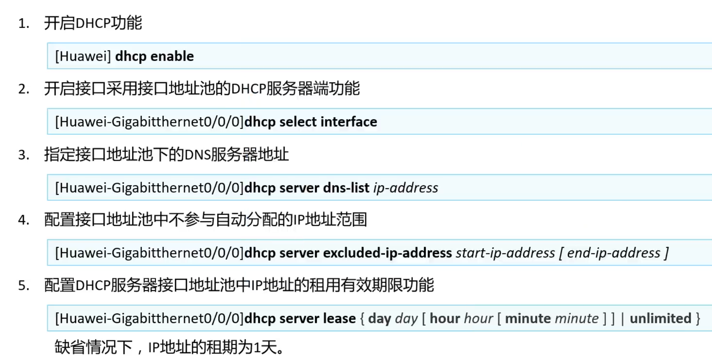
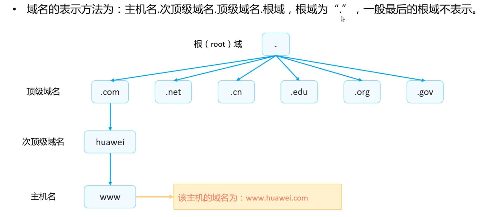
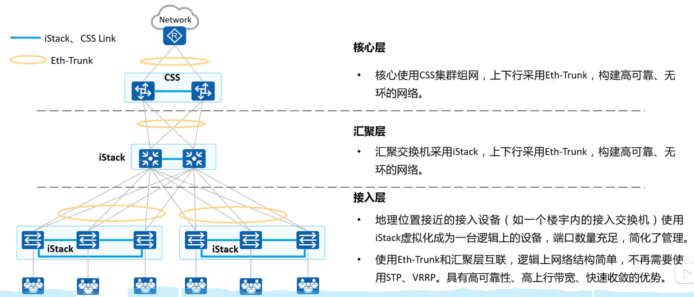
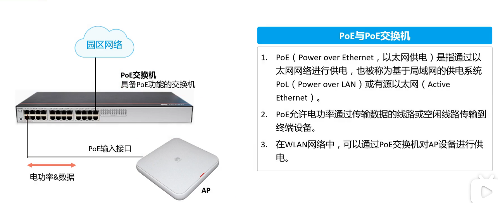

# 计算机网络

### 计算机网络基础		

​		计算机网络是通过**通信线路**和**通信设备**连接的许多的分散**独立工作的**计算机系统，遵从一定的**协议**用软件实现资源共享的系统

​		组成分为**硬件、软件、协议**三部分，协议为计算机网络中进行数据交换而建立的规则、标准或约定的集合

### 网络协议模型

协议分为国际标准OSI/RM七层协议和公认标准TCP/IP四层协议(或五层)。TCP/IP协议簇，包括一系列常用协议

#### 七层模型

#### TCP/IP模型   

- 应用层
  - 软件
- 表示层
  - 对数据进行各种编码表示
- 会话层
  - 两个程序之间的接口
- 传输层
  - 进行TCP和UDP连接，给数据报文打上端口号
- 网络层
  - IP地址和路由寻址
- 数据链路层
  - 控制网络层与物理层之间通信
- 物理层
  - 比特率传输

#### 数据在网络模型中的体现

- 发送数据封装
- 运输中
- 接收数据

### 网络协议和应用

#### OSPF

####  (Open Shortest Path First，开放式最短路径优先协议）

- 一种内部网关协议（IGP），用于在单一自治系统（如企业网络）内进行路由选择。OSPF是基于链路状态路由算法的协议，最初由Cisco开发，并后来标准化为一个开放协议。OSPF的设计目的是克服RIP（Routing Information Protocol）等距离矢量路由协议的一些限制和不足，特别是在大型网络环境中

- OSPF的版本 :
  - OSPFv2：适用于IPv4网络。
  - OSPFv3：适用于IPv6网络，并且也支持IPv4。

- OSPF的工作流程大致包括以下几个步骤：

  - 发现邻居：路由器通过发送Hello数据包来发现相邻的路由器。

  - 建立邻接关系：路由器之间通过交换Hello数据包建立邻接关系，并协商参数。

  - 链路状态通告（LSA）交换：路由器之间交换链路状态通告，告知网络的当前状态。

  - 链路状态数据库同步：每个路由器都会构建一个包含整个网络状态的链路状态数据库（LSDB）。  计算最短路径树：使用Dijkstra算法计算最短路径树（Shortest Path Tree），从而确定最佳路由。

- OSPF的特点

  - 分布式链路状态数据库：每个路由器都会维护一个完整的网络拓扑图，这使得路由计算更加准确。

  - 无环路由：由于每个路由器都有整个网络的完整视图，因此可以避免路由环路。

  - 快速收敛：当网络发生变化时（如链路失效），OSPF能够迅速更新其路由表，使网络恢复正常工作。

  - 支持VLSM（Variable Length Subnet Mask）：允许子网掩码长度不同，从而更有效地利用IP地址空间。

  - 区域划分：为了降低复杂度和提高效率，OSPF网络通常被划分为多个逻辑上的区域（Areas）。区域0（Area 0）是最重要的一级，所有其他区域都必须与之相连。

  - 多播更新：OSPF使用组播来发送链路状态更新，减少了对单播带宽的需求。

#### TCP\UDP

TCP（传输控制协议，Transmission Control Protocol）和UDP（用户数据报协议，User Datagram Protocol）都是位于TCP/IP协议族中的传输层协议，它们为应用程序提供数据传输服务。虽然它们都属于传输层，但它们的设计目标和应用场景有所不同。

##### TCP 特点

1. **面向连接**：TCP是一种面向连接的协议，在数据传输之前必须先建立连接（三次握手），并且在数据传输完成后要释放连接（四次挥手）。
2. **可靠性**：TCP提供了一种可靠的字节流服务。它确保数据包按序到达，并且在数据丢失或损坏时会重新传输数据包。TCP使用序列号和确认应答（ACKs）来保证数据的完整性和顺序性。
3. **流量控制和拥塞控制**：TCP具有流量控制机制，可以避免发送方发送速度过快而导致接收方无法处理的情况。此外，TCP还具备拥塞控制功能，可以在网络拥堵时减少数据发送量，以避免网络拥塞加剧。
4. **开销较大**：由于TCP提供的可靠性，所以它需要较多的开销，包括额外的报头信息、握手建立连接的时间等。

##### UDP 特点

1. **无连接**：UDP是无连接的协议，不需要事先建立连接就可以发送数据报。发送端可以直接发送数据，而接收端直接接收数据，无需事先建立连接。
2. **不可靠**：UDP并不保证数据报的可靠传输，也不保证数据报的顺序。如果数据报在传输过程中丢失，UDP不会重新传输，也不会通知发送方。
3. **低延迟**：由于UDP没有TCP那样的握手建立连接过程，也没有重传机制，所以它的传输延迟较低，非常适合实时应用。
4. **开销较小**：UDP的报头比TCP简单，因此开销相对较小。

##### 应用场景

- **TCP** 适合于那些需要可靠传输的应用程序，例如HTTP、HTTPS、SMTP、FTP等。
- **UDP** 更适合于那些对实时性要求较高、能容忍一定程度数据丢失的应用程序，例如视频会议、VoIP（Voice over IP）、在线游戏、实时音频/视频流等。

##### 报文结构

TCP报文段结构

- 源端口号和目的端口号
- 序列号和确认号
- 数据偏移、保留位、标志位（URG、ACK、PSH、RST、SYN、FIN）
- 窗口大小
- 校验和
- 紧急指针（URG情况下使用）
- 选项（可变长度）

UDP报文段结构

- 源端口号和目的端口号
- 长度（整个用户数据报的长度）
- 校验和（可选，主要用于检测数据报是否损坏）

#### FTP

#### （文件传输协议，File Transfer Protocol）

##### 概念

使用TCP/IP协议族中的TCP协议来提供可靠的数据传输服务。FTP本身是一个应用层协议，它利用TCP所提供的可靠的流式服务来实现数据的高效传输。

FTP工作在客户端-服务器模式下，涉及两条并行的TCP连接：

1. **控制连接**：用于发送命令和接收回复，默认使用TCP端口21。

2. 数据连接

   ：用于实际的数据传输。根据FTP的工作模式不同，数据连接可以有两种形式：

   - **主动模式（Active Mode）**：服务器监听TCP端口20，并且向客户端发起连接请求。
   - **被动模式（Passive Mode）**：服务器监听一个临时端口，等待客户端连接此端口。这种模式对于穿越NAT或防火墙特别有用。

在现代网络环境中，FTP由于其明文传输数据的方式，被认为不太安全。因此，有时会使用更安全的替代方案如SFTP（SSH File Transfer Protocol）、FTPS（FTP over SSL/TLS），或者HTTPS来传输文件。

##### 传输模式             

​	  --**主要用被动模式， 被动模式只用调服务器防火墙         主动模式要调所有客户端防火墙**

- 主动模式  --服务器向客户端发起请求

- 被动模式   

##### ftp命令使用

- ftp        

#### TFTP  

#### 简单FTP

##### **免认证**

#### Telnet  

#### 远程

- 原理 --远程管理-在虚拟类型终端VTY下配置

- Telnet命令

#### DHCP  

- 原理

- DHCP命令

#### HTTPS\HTTP

HTTP（HyperText Transfer Protocol）和HTTPS（HTTP Secure）都是用于在网络上发送和接收信息的协议，但它们之间存在一些关键的区别：

##### HTTP         80

HTTP 是一种允许客户端（通常是浏览器）与服务器进行交互的协议。它主要用于从Web服务器检索HTML文档，这些文档可以被浏览器解析成网页。HTTP是一个无状态的协议，意味着每一个请求和响应都是独立的，服务器不会记住之前发生的任何事情（不过可以通过像Cookies这样的机制来实现一些状态跟踪）。

HTTP请求和响应消息由以下几部分组成：

- 请求行：包含请求方法（GET, POST, PUT等）、请求的URI和HTTP版本。
- 响应状态行：包含HTTP版本、状态码和描述该状态码的原因短语。
- 首部行：包含各种元数据，如内容类型、认证信息等。
- 消息体：可能包含请求或响应的数据。

HTTP默认使用TCP端口80。

##### HTTPS    443

HTTPS 是 HTTP 加上 TLS/SSL 协议层的结果。TLS（Transport Layer Security）或其前身SSL（Secure Sockets Layer）是一种安全协议，它为HTTP提供了加密通道，以保护在客户端和服务器之间传输的信息不被窃听或篡改。HTTPS不仅提供了身份验证保护，还确保了数据的完整性，防止数据在传输过程中被修改。

HTTPS请求和响应的结构与HTTP相同，但是所有的通信都会经过加密处理。这意味着即使有人拦截了网络流量，他们也无法读取实际的内容。

HTTPS默认使用TCP端口443。

##### 总结    

- **HTTP** 是一个简单的协议，没有加密，适用于不需要安全性的场景。
- **HTTPS** 则增加了安全性，通过TLS/SSL来加密数据，适用于需要保护隐私和安全的场景，如在线交易、用户登录等。

在现代Web开发中，出于安全考虑，HTTPS已经成为标准，尤其是在处理敏感信息时。许多浏览器和服务提供商也鼓励使用HTTPS，甚至对使用HTTP的网站给予警告或限制。

- 

#### DNS

#### （Domain Name System，域名系统）

是一种分布式数据库系统，它的主要作用是将人类易于记忆的域名，DNS使得互联网上的主机可以通过名字而不是难以记忆的数字字符串来相互识别和通信。

##### DNS的主要功能

1. **名称解析**：将域名转换为IP地址。
2. **邮件路由**：通过MX记录来确定电子邮件的路由。
3. **负载均衡**：通过CNAME记录和其他策略来分散流量到多个服务器。
4. **安全性和认证**：使用TXT记录来支持SPF（Sender Policy Framework）等安全措施，防止电子邮件欺诈。

##### DNS的工作原理

当客户端尝试访问某个域名时，如下步骤通常会发生：

1. **本地缓存查找**：首先检查本地缓存（操作系统或浏览器缓存），如果命中则直接返回结果。
2. **本地DNS服务器查询**：如果没有命中缓存，则向本地DNS服务器（ISP提供的DNS服务器或其他指定的DNS服务器）发送查询请求。
3. **递归或迭代查询**：本地DNS服务器可能会继续向上级DNS服务器（如根DNS服务器、顶级域DNS服务器等）进行递归或迭代查询，直到找到正确的IP地址。
4. **返回结果**：一旦找到正确的IP地址，就会沿着查询路径返回给最初的客户端，并且沿途的DNS服务器都会暂时存储这个映射关系，以便未来的快速响应。

##### DNS记录类型

DNS系统中使用了多种类型的记录来满足不同的需求：

- **A记录**：将域名指向IPv4地址。
- **AAAA记录**：将域名指向IPv6地址。
- **CNAME记录**：规范名记录，用于将一个域名别名指向另一个域名。
- **MX记录**：邮件交换记录，用于电子邮件路由。
- **NS记录**：名称服务器记录，指示哪个DNS服务器负责某个域。
- **PTR记录**：指针记录，用于反向解析IP地址到域名。
- **TXT记录**：文本记录，用于存储任意文本信息，常用于SPF记录等。
- **SOA记录**：起始授权记录，标识一个区域的开始，并提供有关区域的管理信息。

#### CDN

CDN（Content Delivery Network，内容分发网络）是一种广泛部署在全球各地的网络系统，旨在提高互联网内容的传输效率和用户体验。CDN的主要目的是减少延迟（latency），提高可用性和容量，同时减轻源服务器的负载

#### NTP            

####  Network Time Protocol

- 

### 网络地址

- PC、手机在内网，用私网地址-------转换成公网地址
- 公网地址要收费需要购买

#### 私网地址

#### 特殊IP地址

公网地址不会有私网地址的路由    配路由

### 网络设备

#### 网络设备配置命令-华为

|      缩写      |                             命令                             |                             解释                             |                |
| :------------: | :----------------------------------------------------------: | :----------------------------------------------------------: | :------------: |
|                |                             save                             |       保存（一定要保存，配置在缓存中，断电会丢失配置）       |                |
|                |                           dis this                           |                         显示接口配置                         |                |
|      sys       |                         system-view                          |                          图形化界面                          |                |
|      int       |                       interface g0/0/1                       |                           进入接口                           |                |
|                |              ip address 1.1.1.254 255.255.255.0              |                       接口配置网关地址                       |                |
|                |                             undo                             |                           删除命令                           |                |
|      dis       |                           dispaly                            |                             展示                             |                |
|                |                           dis int                            |                         显示所有接口                         |                |
|                |                        dis int brief                         |                         显示接口概述                         |                |
|                |                       dis ip int brief                       |                       查看IP与接口信息                       |                |
|                |                           dis vlan                           |                         查看所有vlan                         |                |
|     路由表     |                     dis ip routing-table                     |                          查看路由表                          |                |
|      arp       |                           dis arp                            | ARP（Address Resolution Protocol，地址解析协议）表，通常称为ARP缓存或ARP表，是存储在计算机中的一张表，记录了IP地址到MAC地址的映射关系。 |                |
|      mac       |                       dis mac-address                        |                        显示mac地址表                         |                |
|                |                  mac-address aging-time 200                  |                改变老化时间–默认老化时间300秒                |                |
|    静态路由    |         ip route-static 192.168.1.1 24 192.168.1.254         |                         静态路由配置                         |                |
|    动态路由    |                         dchp enable                          |                       开启动态路由配置                       |                |
|                |                 在接口 dhcp select interface                 |                   接口选择开启动态路由配置                   |                |
|                |              dhcp sever dns-list 192.168.1.100               |                       动态路由DNS分配                        | pc需要重启网卡 |
|      vlan      |                           vlan 10                            |                           新建vlan                           |                |
|                |                           dis vlan                           |                         查看所有vlan                         |                |
| **三层交换机** |                       交换机-交换机-PC                       |                                                              |                |
|                |                进入接口 port link-type access                |            Access模式：用来连接终端，电脑，打印机            |                |
|                |                     port default vlan 10                     |                        设置接口的vlan                        |                |
|                |                进入接口 port link-type trunk                 |               Trunck模式：用来连接其他的交换机               |                |
|                |                port trunk allow-pass vlan all                |                       允许所有vlan通过                       |                |
|  **单臂路由**  |                       路由器-交换机-PC                       |                                                              |                |
|                |              interface GigabitEthernet0/0/0.10               |                        分出一个子接口                        |                |
|                |                   dot1g termination vid 10                   |                          关联vlan10                          |                |
|                |              ip address 1.1.1.254 255.255.255.0              |                           接口配Ip                           |                |
|                |                     arp broadcast enable                     |                         开启arp广播                          |                |
|      acl       |                   步骤一：创建访问控制规则                   |                     步骤二：调用这个规则                     |                |
|                |                         dis acl all                          |                       显示所有acl规则                        |                |
|                |                     acl name test basic                      |          做访问控制 只会检查原地址 不会检查目标地址          |                |
|                |                    acl name test advance                     |                  做访问控制 会检查目标地址                   |                |
|                |                           acl 3999                           |                  需要用cal号才能进入配置acl                  |                |
|                |                             deny                             |                             禁止                             |                |
|                |                            permit                            |                             允许                             |                |
|                | rule deny ip source 192.168.10.0 0.0.0.255 destination 192.168.30.0 0.0.0.255 |                       禁止10段访问30段                       |                |
|                |          rule permit ip source any destination any           |                         允许其他所有                         |                |
|    调用acl     |                          int g0/0/1                          |                                                              |                |
|                |             traffic-filter inbound acl name test             |                                                              |                |
|    nat转换     |                     内网地址转换公网地址                     |                                                              |                |
|                |         ip route-static  0.0.0.0   0.0.0.0   下一跳          |                 缺省路由（到公网地址的路由）                 |                |
|                |                    acl name newwang basic                    |                   新建（只看原地址的）规则                   |                |
|                |            nat address-group 1 64.1.1.2 64.1.1.10            |             nat address-group name 新建nat地址池             |                |
|                |                    dis nat address-group                     |                        查看nat地址池                         |                |
|                |                         dis cal all                          |                                                              |                |
|                |                           acl 2998                           |                           进入规则                           |                |
|                |          rule permit source 192.168.0.0 0.0.255.255          |                           设置规则                           |                |
|                |             nat outbound 2998 address-group 1 ?              |                 nat出口调用规则 转换成nat组1                 |                |

#### arp、mac-address、ip routing-table表

mac地址表

​	记录每一个mac地址来自哪个接口，由交换机记录

​	默认老化时间300秒

改变老化时间

​	mac-address aging-time 200

arp协议

​	帮助pc完成数据包目标mac的封装      

完成arp解析后，会把结果记录在arp缓存表中，以后直接查表就行了

#### Nat

###### 动态nat

- 
- 
- 

###### 静态nat

- 服务器布置服务对外发布，绑定一对一公网地址
- 先配静态路由（需要配置内网到公网200.200.200.200的路由ip route-static 200.200.200.0 24 119.1.1.2），再配静态nat
- 静态nat配置     nat sever global 119.1.1.123 inside 172.16.0.1

###### 主流--NAPT

- NAPT 网络地址端口转换--------NAT映射表

###### 主流--Easy-ip                 ---转成接口IP端口     接口地址不固定的时候用easy-ip

###### 

#### acl   访问 控制 列表

- 步骤一：创建访问控制规则

- 步骤二：调用这个规则

- acl name test basic  做访问控制  只会检查原地址  不会检查目标地址

- acl name test advance  做访问控制   会检查目标地址

  - acl name test advance  

  - dis acl all

  - acl 3999

    - rule deny ip source 192.168.10.0 0.0.0.255 destination 192.168.30.0 0.0.0.255 

    - rule permit ip source any destination  any

  - [Huawei]int g0/0/1

  - [Huawei-GigabitEthernet0/0/1]traffic-filter inbound acl name test

概述---------像一个门卫

通配符验码

​      acl的通配符验码反着写  0.0.0.255

###### acl命令

###### 高级acl命令

#### AAA   认证

- 概述
- 认证方式
- 授权
- 计费
- RADIUS协议-用户和NAS之间有多种协议，NAS到AAA只有一种RADIUS协议
- AAA配置命令

#### 链路聚合配置命令

- 手动配置链路聚合

  - interface Eth-Trunk 1 创建聚合组1

  - eth-trunk 1 在接口把接口加入聚合组1

  - int eth-trunk 1 进入聚合组1 

  - port link-type access\port default vlan 10 设置端口

- 动态聚合配置LACP

  

#### 堆叠、集群

- 可靠性高、性能强、管理简单
- 应用
- 推荐架构

#### WLAN--无线局域网

##### 概述      wifi 基于802.11的标准的无线局域网技术

- 

- Wifi版本     以前   5GHZ 兼容性差、抗干扰能力差   唯一优点  快       现在  5GHz  好
  - 

##### WLAN组网架构

- AC无线控制器

- POE交换机--可以用网线供电

##### AP和AC的组网

##### 无线通信系统  电磁波

- 2.4GHZ 用 1 6 11信道         5G信道都不重叠

- BSS   一个AP所覆盖的范围
  - 

##### VAP  一个ap放出两个信号

- 

##### ESS  多个AP放出一个信号 

- 

##### 实验

- 瘦AP           STA1用802.11封装的包发给AP1（802.11封装的是无线的包，只有AP才能识别，非无线的交换机、路由器不能识别） ，AP1会在包上加上新的IP头部文件，再交给交换机，交换机才能识别 ，交换机把包给AC，AC把包转换成有线能识别的包，再通过路由器转发出去

##### 思路

- AC和AP的联通性

- 在AC上配置和WLAN相关的参数

- 将AP加入AP组

#### 广域网----专线PPP、PPPOE

##### 找通讯公司租用线路

##### PPP协议    点到点通信   只支持两个节点的通信

- PPP协议三层认证

  - 链路层协商

  - 认证模式 PAP

  - 认证模式CHAP

  ##### 网络层

##### PPPoE   宽带拨号          PPP结合以太网

- 

- 

- 

- 配置

#### 路由器

##### 接口可以配IP

##### 进行网络地址转换  

- nat动态转换        
  - 在出接口上把私网地址转换为公网地址

- nat静态转换
  - 在出接口一对一绑定私网地址和公网地址

- 路由器网络

#### 交换机

##### 转发方式（看mac地址表内是否有）

- 泛洪（mac表没有）

- 转发（mac表有）

- 丢弃（信息来源接口和信息目的地接口一致）

##### 接口不能直接配IP 

通过绑定VLAN来配IP地址

##### 交换机的接口模式

- Access模式：用来连接终端，电脑，打印机

- Trunck模式：用来连接其他的交换机

#### 防火墙

保护内网的安全产品

- 软件防火墙

- 硬件防火墙

  - 内网和外网之间          

  - 专网和互联网之间

  - 防火墙的接口模式

- 防火墙策略（举例子-华为防火墙）

  - 安全域

  - 做放行策略   policy interzone trust untrust outbound 

  - 私网IP转公网IP需要做nat
    - easy-ip 做地址转换的时候，自动转成出接口地址

  - 回程路由
    - 数据包从防火墙回到PC需要回程路由

#### 园区网路

- 园区网络架构
  - 技术

- 中小型网络系统搭建实验

  - 思路

    

    - 配置内网环境、配置外网环境

    - 在LSW1和AR1之间配置静态路由

    - 在AR1的1扣配置路由出口转换   允许内网访问外网

    - 在AR1的0扣配置acl规则   绑定到0口   禁止PC1访问外网

    - 在AR1的1配置静态路由转换  允许外网访问sever

#### 网络管理基本功能

##### OSI

##### SNMP   服务器集中管理软件

- 不同厂商有不同的软件   

##### SDN  软件定义网络

- 计算机发展
  - 

- OpenFlow流标

- 网络架构

##### NFV     云化 虚拟化

- 背景

  - 启

  

#### 网络自动化管理

##### 计算技术栈

- 执行过程

##### 高级编程语言    

​	不用考虑硬件          

​	 编译型语言  要考虑硬件

### 计算机网络分类

- 个人区域网  PAN

- 局域网    LAN

- 城域网    MAN

- 广域网 = 万维网    WAN
- 无线局域网     WLAN 

- 网络设备

  - 中继器

  - 集线器

  - 网桥

  - 交换机

  - 路由器

- MAC地址 

  - 媒体访问控制 (MAC) 地址是制造时分配给每个启用了网络的设备的唯一标识符。

  - 它可以称为已烧录地址、以太网硬件地址或物理地址。

  - MAC 地址的前三个数字定义制造商的组织唯一标识符 (OUI)，其余三个数字唯一地标识设备。 

