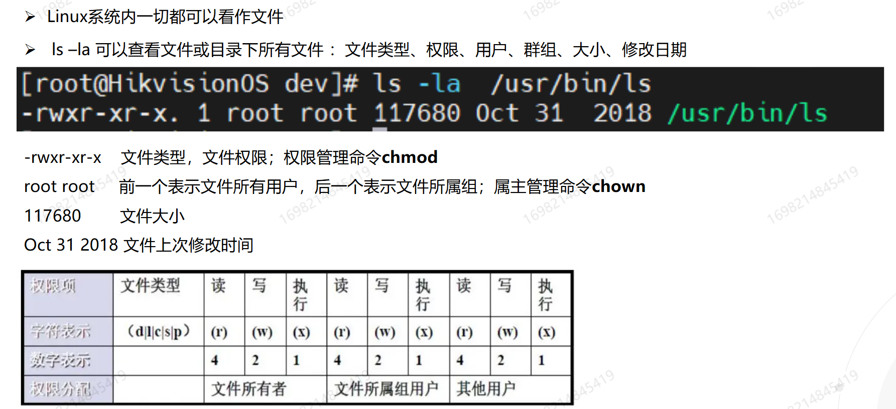
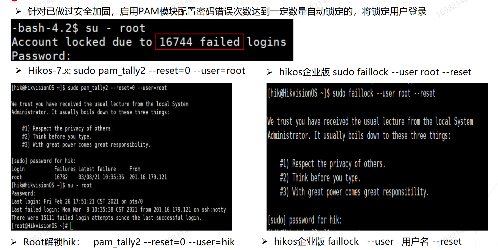
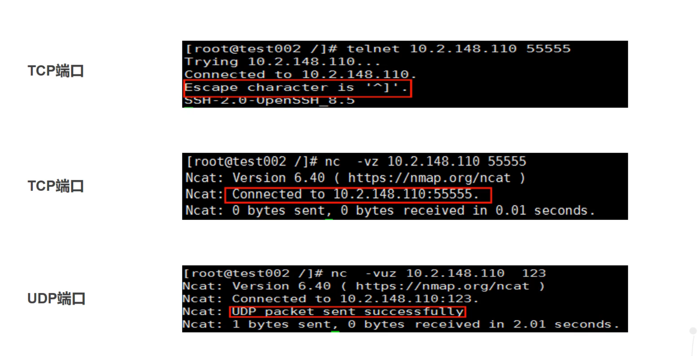
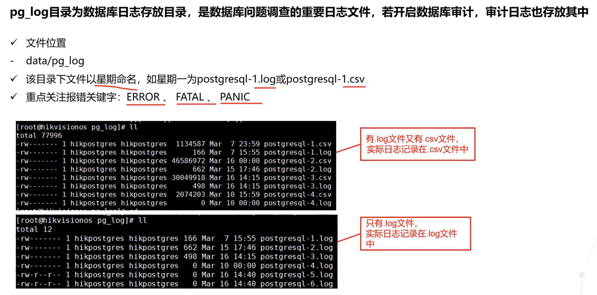
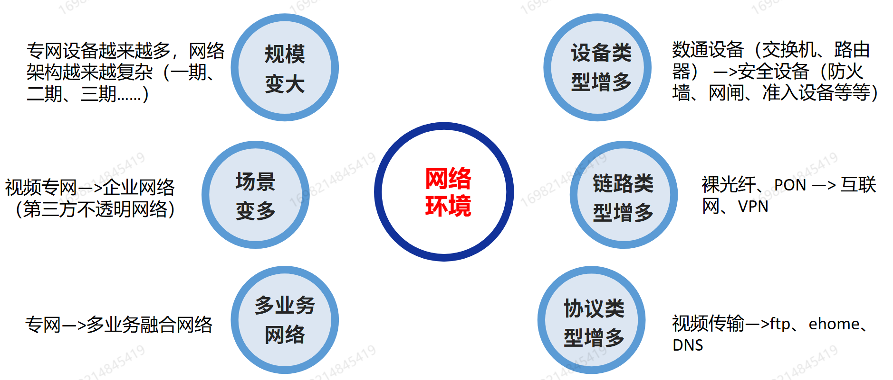
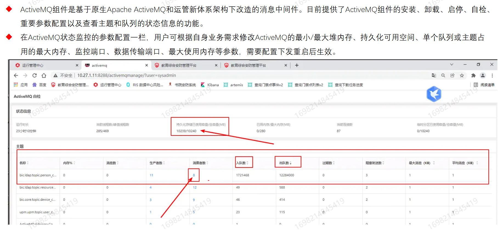

# linux系统日常维护

## Linux目录结构

ls

ls -a	   						 而 `-a` 表示列出所有文件

ls -l          ==        ll        用于以长格式列出文件和目录信息

ls -la

## Linux 文件类型和文件权限

### chmod

### 文件创建、查看、移动、复制、删除

### 文件修改VIM

### 文件查找find

### grep行查找命令

### 文件管理常见问题

du-sh磁盘使用 

df -h 磁盘空闲

- `du`：是“disk usage”的缩写，用于显示文件或目录所占的磁盘空间。
- `-s`：选项表示“summarize”，即只显示总计大小，而不是每个子目录或文件的详细信息。
- `-h`：选项表示“human-readable”，使输出的大小信息更易于阅读，比如使用K（千字节）、M（兆字节）、G（吉字节）等单位。

## 用户管理

### 用户分类

### Linux用户增删改

### 重置用户密码

### ssh登录异常

## Linux网络管理

### 查找占用带宽高的服务

### TCP/UDP端口测试

Telnet是tcp协议的

### 网络管理常见问题—-服务启动失败

## 防火墙配置

### iptables

### firewalld

### 问题

# PostgreSQL数据库

## PG体系结构

### pg11数据库

#### data目录

**只有log目录文件可以动  其他都不能动**

**pg在文件权限方面管的比较严**

##### pg_hba_conf

##### 数据文件

## PG数据库连接

### dbeaver

### 命令行登录

### 常用命令

## PG启停与排障

### systemctl启停

### pg_ctl 启停

### 报错处理

### pg_log

# 网络常见问题排查

## 网络问题现状分析

光纤分类

1. 单模光纤（Single-Mode Fiber, SMF）
   - 单模光纤设计用于传输单一模式的光波，通常直径在8~10微米之间。这种光纤具有较低的色散，适合长距离传输，如跨洋通信等。
2. 多模光纤（Multi-Mode Fiber, MMF）
   - 多模光纤能够同时传输多个模式的光波，其芯径较大，通常为50微米或62.5微米。由于存在模式色散，多模光纤适用于较短距离的通信，比如局域网内。

## 网络问题排查方法

### 网络问题排查工具

# 基础组件介绍及问题排查

## 代理服务器

- **Nginx 作为前端服务器**：处理静态文件、负载均衡和反向代理，将动态请求转发到后端的 Tomcat 服务器。
- **Tomcat 作为后端服务器**：专注于处理 Java Web 应用程序的动态内容。

## Tomcat-后端服务器

## Nginx-前端服务器

## 消息中间件MQ

**开源的消息代理（Message Broker）和队列服务器（Queue Server）**

- 如果你需要灵活的消息路由和多种消息模式，并且不局限于 Java 应用，可以选择 **RabbitMQ**。
- 如果你的应用主要是 Java 开发，或者需要支持多种消息协议，可以选择 **ActiveMQ**

## ActiveMQ-消息中间件

### 基于Apache

- 

## RabbitMq-消息中间件

## Redis -缓存数据库

## Consul -用于实现分布式系统的服务发现与配置管理

**google开源的使用go语言开发的**

## LDAP-身份验证和授权。

###  Lightweight Directory Access Protocol 

- **类型**：LDAP 是一种用于访问和维护分布式目录信息服务的标准协议。
- **用途**：主要用于存储和检索组织中的用户和组信息，常用于身份验证和授权。

# 教材

# 第一天

## PVIA平台介绍

### B/S C/S APP 三端

## 平台

PVIA2.30基于IFar 2.2.4

老平台 iFar1.6x

### 电子地图功能

地图资源操作

资源操作

收藏夹管理

新增视域联动

新增网格规划

### 智能搜索

提供文本搜索、智图研判、视频智能解析、身份确认和关系搜索等应用功能

#### 	新增功能

​	以物搜人

​	特征搜车

​	图文检索

### 多维预警

#### 个体布控

支持收藏夹选点

#### 群体布控

常控库和临控库

支持选择人员车辆标签和人员车辆名单下发临控库布控

驾乘人员布控合并到人员名单布控页面

### 图上追踪

多维研判

递进研判

线索管理

路径拟合

​	通过对人脸、人体、车辆看到多维度研判和数据关联，可自动形成一条多维拟合路径

### 技战法

​	17页

## Pvia快速部署

新版本HikOS-Enterprise-V1.1.0 基于 openEuler 22.03 结合自身产品特点优化定制而来

#### 系统安装

默认英文 自动安装 hik\root 密码123456

500以下 root/opt 对半分 大于500 root 250 其余opt

#### 安全防护

root禁止ssh登录 ssh端口55555关闭ssh服务自启动

#### 系统优化

系统默认部署 iptools.sh bond.sh smem iotop iperf3 traceroute

### 新增功能

#### 防误装系统

Ctrl + ALT + F3进入anaconda模式

#### 防误删文件

cat /etc/safe-rm.conf

部署 防止rm -rf /*跑路

### 安装完后配置

#### 手动安装

只需要调整磁盘分区，其他不

#### version看版本

#### lsblk看分区及挂载

#### 保密 ：root 用户禁止ssh远程 sshd 服务器默认开启PAM模式

ctrl + alt + del 重启功能

安全加固 start表示设置 cancel表示取消

300秒内无用户操作自动断开

#### 用户密码解锁

对root密码错误三次解锁

faillock - user 用户名 -reset 			root解锁其他

sudo faillock -user root - reset 		hik解锁root

#### 三级等保加固

密码有效期

密码复杂度

密码错误锁定三次

超时退出

#### 系统参数默认优化

最大打开进程数、最大可分配PID、最大分配线程数、最大打开文件描述符

### 系统自带工具

iptools.sh bond.sh smem iotop iperf3 traceroute

## 远程访问

新版本不用network.service 配置网络   用 NetworkManager服务对网络进行管理

#### ethtool

支持网卡链路类型、网卡建立的链路速率、网卡的类型

ethtool -p ens3 网口闪烁

服务器主板自带网卡仅1000M

#### reload_NetworkManager 手动改配置文件

reload_NetworkManager 		海康OS系统独有或者

nmcli connection reload & nmcli connection		 网卡名

#### iptool.sh

ethtool 网卡   	确认网卡名称

执行 iptools.sh

ip a

route -n   确认结果

#### Bond模式 – 多网卡绑定

需要交换机配置的模式：0 2 3 4 模式4需要交换机做动态链路聚合	其余静态聚合绑定

1 5 6 不做交换机聚合配置

自带**Bond.sh 可针对2个网卡进行绑定配置**

#### sshd

systemctl enable sshd –now     设置自动开启

systemctl is-enable sshd 

#### 密码重置-按e进入grep

默认 root hikos@2022

修改ro为rw   添加 init = /bin/sh

passwd 用户 修改密码

#### 系统分区

sda6逻辑分区-包含剩余全部空间用于创建hikvisionos卷组

/dev/mapper/hikvision-root挂载、

#### LVM

磁盘sdc - 物理卷 sdc - 卷组 datavg - 逻辑卷 lv_asw - 文件系统 /mnt

#### 系统补丁升级

全部安装  ./HikOS-Enterprise-xxxxx_all **会自动重启主机**

不升级内核 不会重启

仅解压 不升级

## 业务

#### 四种部署场景

纯视频场景、小型智能场景、中大型智能场景、大型全量应用场景

**合理化的软硬件部署清单**

#### 自定义场景**  

特出场景

#### 部署局限性

支持Pvia2.2.0以上

服务器最大支持20台服务器

**以图搜图要手动安装**

#### 并发场景

一台dac 600

预览数据库*设备发流码率    < 600 则dac\ncg无需单独部署

## 运管服务介绍

#### hik_@bic.center.1.service

运管中心服务，内置是Tomcat服务，监听端口8011

**重启运管 systemctl restart hik_@bic.center.1.service**

#### hik_@bic.proxy.1.service

 代理服务 是一个nginx服务 端口 8001

#### database

pg 7001

#### ldap

7003

#### notify

7002\8356\8288\38500

#### hik.opsmgr.agent.service 本地代理服务

#### hik.opsmgr.monitoragent.service 监控代理服务

#### hik.opsmgr.notifyagent.service 通知代理 

#### hik.opsmgr.logagent.service 日志代理

#### hik.opsmgr.ntpd.service 授时代理

## 运管

通过安装监控代理服务器，监控服务器的CPU、内存、磁盘、IO等基础指标

#### 服务器管理

查看服务器间是否通信、服务器是否在线

#### 配置管理

修改组件服务器端口、日志级别、中间件的内存参数等  

便于统一管理

#### 防火墙策略

firewall-reload 配置重启

配置文件 	/etc/firewalld/services/hik_firewallconfig_service.xml

#### 校时服务器

运管中心设置校时源      获取校时ip        sdmc/xresmgr       调用dac下发校时源ip       设备主动校时

#### 系统管理

用户管理、菜单管理、下载项管理、认证管理、证书管理

## 功能介绍f

**优化水印** 			2.3支持

#### 视频配置

系统管理	-通用配置管理 	-通用参数配置	-视频配置

#### 添加视频设备

**先选择区域，点击添加**

2.0-4.0 	选择 Ehome 		7660

5.0 			ISUP5..0协议		7031

#### 角色管理

人员信息非必填

##### 新增

可管理用户组

##### 创建用户组

创建“用户组”进行管理 角色

则用户组下所有用户拥有该角色的权限

#### 创建用户-账户信息

基本信息

安全信息

登录认证

##### 人员信息

人员信息非必填

#### 存储配置

 https : ip :5120

系统管理-通用配置管理-存储接入管理-存储设备-  添加

必须开启存储设备的图片属性 功能

#### 录像计划

存储选择

码流类型

资源池

取流方式

计划模板

## 地图

手动选择需要自定义地图的区域后，点击GIS地图进行配置  成功后会有绿色标识

#### 离线地图下载工具

HMAP 地图下载工具  

公司内网使用

#### 离线地图

压缩的地图zip放置到

​	/opt/opsmgr/web/components/xmap.1/dat/map

## 协议

#### SIP协议

可以UDP\TCP   

大多数用udp

#### 编码规则

中心编码  8位  行业编码 2位 类型编码 3位 序号 7位

131-132 监控点编码

138 执法编码

## ncg介绍

GB/T28181   DB33/T629	GB35114

同网或者跨网环境下实现互联互通

#### 资源重新推送可以生成共享平台资源的CSV

#### 网关配置

配置本级网关信令，主要有信令服务，多网域配置，通用配置

#### 配置外域

6.流保活：默认开启，如短流可以尝试关闭

#### 资源检索

资源检索步骤

​	检索本级域、下级域

​	点击资源检索按钮

​	检索完成之后可在页面查看组织资源和点位设备的嗯个详细资源

#### 组织规划

选择上下级域

选择资源共享页面，勾选想要规划的组织或点位，点击目录调整

父组织要比子组织先共享

选择原编码，或者标准转换编码

#### 移动订阅配置

上级要获取移动设备的gps信息，需要用到**移动订阅**配置

#### 服务器参数配置

受网络环境限制	

有时候需要修改信令端口和取流端口段

运管-状态监控-ncg-服务参数配置   信令端口7100取流端口 26100-26899

#### NMS网管组件简介

Nms2.9.100 paf 2.9.100该版本兼容新老架构

注：

​	组件不建议直接平滑升级

​	建议卸载安装，不保留数据库

## 运维概括

#### 录像完整

点位前一天24小时

#### 视频质量诊断

paf.1/resource/probes/paf_vqd_general/logsxxxx.log

视频质量诊断的业务类型为：  businessType: vqd

#### 录像完整性

完整性  businessType：record

保存天数： businessType：monthRecord

## 常见问题

**常见多线路为匹配，需要将paf添加多线路 **         153

## HDI 海康数据集成平台

### 场景

​	数据对接和数据级联

### 强烈以组件方式安装部署

#### 数据集成平台 detl

数据管道、进行数据接入、分发、清洗转换   2.4.3HDI

#### 数据级联dcascade

3.0.3HDI

### 级联协议

#### 1400标准协议

2017、2018版本

支持人脸、人体、车辆等试图抓拍数据

#### 1400扩展协议

支持人脸、人体、车辆等试图抓拍数据

增加了部分海康私有字段

#### 海康私有协议

上下都是海康HDI建议走

支持人脸、人体、车辆等

### 部署建议

#### 组件部署-常用部署方式

### 授权说明

单套授权峰值

​	大图120秒每张	550k

​	小图1200	50k

​	无图4000   5k

单套授权无图性能从 8000 –4000   原因：cpu性能

初始化配置-dcascade数据级联初始化

​	试图库网关IP填写本级级联组件IP端口7339

# 第二天

### 工具

#### 数据库

端口7092

/opt/opsmgr/web/components

xxx.1/conf/config.properties

#### LDap 

7003

/opt/opsmgr/web/components/@bic.1/conf

#### ES

http://10.199.247.224:9200/

/opt/opsmgr/web/components/elasticsearch.1/conf

#### Wireshark

sip查看sip信息

tcp.port ==xxx 查看与此IP交互相关信令

uod.port ==

#### SocketTool

调试工具是一款网络TCP/UDP通信调试工具

#### HPSclientdemo

实时预览、回放取流、录像下载、码流分析

#### ActiveMQ

路径、/opt/…../con…ts/activemq.1/conf

#### 核心脚本服务集

中间件一件修复 

6个

#### 故障数-流程类工具

支持网页端和手机端

#### RabbitMQ_Tool 

8075、6005

连接不上可能是防火墙没开，可以在运管策略配置打开8075和6005端口的访问

#### Linux抓包工具

## 业务流程介绍

#### 包含媒体功能的：DAC \ NCG

#### DAC设备接入框架

实时取流转发分发、设备存储录像回放、设备控制、视频告警转发

心跳交互端口：**7307**

#### MGC媒体网关

手机app和open api 取流，必须过MGCw

#### SAC存储接入组件

录像计划都在里面

**SAC向中心存储查询片段信息**

视频点播VOD向中心存储取流 

SAC给VNSC短URL   VNSC给VOD长URL

#### VNSC视频联网共享

媒体管理、媒体调度、媒体链路可视化

#### NCG视频联网网关

上下级注册 资源同步 实时预览 录像回放域控制 录像下载 语言广播 设备控制

#### VOD视频点播

​	中心存储的流行回放取流、录像下载、倒放、倍速回放、倍速下载等

#### TVMS电视墙组件

电视墙、解码器   解码上墙

#### 视频上墙		

**国标解码取流上墙，被动取流**

**电视墙客户端发起录像查询和回放取流，成功后主动推送给解码器上墙**

##### 回放上墙

客户端将缓存中录像码流**通过SDK方式**推送给解码器进行上墙

##### 本地上墙

将桌面流抓取sdk推送给解码器进行上墙

#### 视频网管NMS资源同步

**nms2.9.100版本级联点位状态由nms向cng获取csv进行巡检**

路径 ： /tomcat.1/webapps/nms/WEB-INF/classes/sync/out/status/日期文件夹

status   0-离线 1-在线

##### sdmc下载的csv

/tomcat.1/webapps/nms/WEB-INF/classes/sync/in/nms

status   0-离线 1-在线

#### 视频级联回放取流

上级客户端向NCG网关（上级平台）回放取流

## 问题排查

**dac-media取流日志插件**   dac-media.plugins.debug.log

### 日志服务调用链查找日志所在位置

xx/components/vnsc.1/logs/vnsc/mls/vnsc.mls.debug.log

## 点位状态巡检

### **被动协议设备** 

​	**hikSDK 	dhSDK	onvif**

日志搜索监控点所属设备编码的资源编码

### 主动设备

​	**gb 	ehome 	isup**

**国标协议没有提到状态概念，无法获取到通道状态，国标接入设备通道域设备状态一致**

**定期扫描漏洞**

**6个月日志保存**

**远程服务前必修提交远程服务申请**

## 高危操作

数据采集下发误取消

运管误卸载重要组件iac或者iac的数据接入驱动包

运管误删资源服务器xres

#### 设备删除要谨慎

IPC加重，会导致监控点编码变更，与存储本身存储的编码设备ID不一致，无法查询历史录像

删除CVR/CVM会导致设备编码变更，SAC内已存的录像轨迹信息丢失，重加后查询不到历史录像

#### 空格惨案

部分CVR版本不支持带有空格的编码器名称

建议一个CVR配置一个存储域，一个资源池

#### 存储域不要开启负载均衡

#### 平台升级

启动sac服务前

​	先升级xres\xfront到172版本

​	xres\xfront\sac有无打上最新基线补丁合集

​	升级检查平台资源数量是否Idap中一致

## 新体系和录像相关的插件

​	SAC	下发录像

​	VNSC 预览回放链接生成

​	VMS 

​    DAC	设备接入

​	VOD 中心存储回放取流	媒体服务媒体转发

#### 卸载iac组件不会影响PVIA平台录像查询功能

## 系统维护指导思想

### 风险识别与管理

### 明确指定方案和计划

### 主动维护

### 系统维优

## 系统备份

开启变备份变压缩

关闭：增加磁盘空间 占用 ，会消耗两倍备份空间，但是io占用相对较低，机械盘，io占用较为敏感

支持海康云存储、SFTP存储和本地存储 推荐使用云存储或SFTP方式

## 数据恢复步骤

#### 还原前环境准备

尽量和之前保持一致

还原目录  -254页

#### ldap文件准备

四个文件

slapd.d config.properties installation.properties ldapbackup.ldif

#### 数据库备份文件准备

如果返回为UTF-8格式 则把*.dmp后缀改为*.sql

rename .dmp .sqp ./*.dmp 全量修改命令

组件版本  ais_1.6.2005

软件版本确认

执行还原 

还原结束

du -sh

df -h

free -g

lsof -i:8001 监听端口

ps -ef | gref  14547